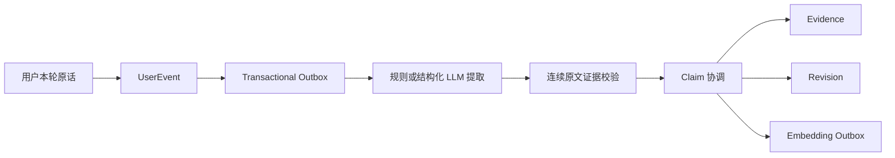

# Terrain Memory Engine V2

本文是当前代码的运行说明，不替代根目录的产品与技术基线。V2 以影子链路接入现有四层记忆系统，目标是先获得可验证的数据，再逐级切换召回，不直接覆盖旧表。

## 当前默认状态

| 配置 | 默认值 | 行为 |
|---|---:|---|
| `MEMORY_V2_MODE` | `shadow_write` | 写用户事件、Outbox 和 Claim，不注入回复 |
| `MEMORY_V2_EXTRACTOR_MODE` | `rules` | 只使用确定性显式表达规则，不产生模型费用 |
| `MEMORY_V2_EMBEDDING_ENABLED` | `false` | 默认不产生向量费用；启用后生产使用 pgvector HNSW |
| `MEMORY_V2_RETRIEVAL_TOPK` | `2` | 一次回复最多选择两条长期记忆 |

模式按以下顺序灰度：

1. `off`：完全关闭 V2；
2. `shadow_write`：可靠双写与异步抽取，不运行 V2 召回；
3. `shadow_retrieve`：运行召回并写 Trace，但不把结果放入模型上下文；
4. `active`：只有通过状态、时间和敏感度门禁的结果才进入回复上下文。

回滚只需把模式退回上一级。Legacy 表和接口保持不变，因此不需要反向搬迁数据。

## 写入算法



关键不变量：

- `UserEvent` 只保存用户输入；AI 回复、系统提示和危机模板不能成为用户事实证据。
- 每个 Atom 的 `evidence_text` 必须能在同一条用户原话中逐字定位；定位失败直接丢弃。
- 危机表达进入安全流程，不写长期 Claim。
- 低风险、明确表达且达到阈值的事实可以直接 `confirmed`；敏感内容、互动策略和推断内容保持 `proposed`。
- 名字等单值槽出现新值时只创建待确认版本；旧值继续有效，直到用户确认新版本。
- 喜欢、目标、习惯等集合型事实可以并存，不能因为同属一个类别而互相覆盖。
- 每次创建、补证、冲突、确认、纠正、隐藏和替代都写 `MemoryRevision`。

Outbox 与 UserEvent 在同一个数据库事务中提交。Worker 使用有限批次、指数退避、最大重试次数和 `dead` 状态；Outbox 不复制用户正文，只保存事件 ID。

## 召回与遗忘

先由规则门判断本轮是否真的需要长期记忆。没有“记得、之前、最近、关系延续”等清晰信号时返回 `none`，避免为了表现聪明而强行提历史。

候选只允许 `confirmed` 或 `corrected`，并检查 `valid_from/valid_to`。当前评分为：

```text
base =
  0.30 * semantic
  + 0.18 * lexical
  + 0.15 * temporal
  + 0.10 * continuity
  + 0.10 * importance
  + 0.05 * pin
  + 0.12 * activation

final = base * confidence
```

`activation = (days_since_last_landed + 1)^-0.35`，每次按绝对时间重新计算，不在旧权重上重复衰减；置顶记忆的 activation 固定为 1。实际用于回复后更新 `last_landed_at`、`retrieval_count` 并写 `MemoryRetrievalTrace`。同一槽只取一个版本、同一类别最多两条、总数最多两条。

敏感 Claim 即使已确认，也必须同时满足用户允许主动引用和强相关匹配。无合格候选时返回空结果。

生产 PostgreSQL 使用 pgvector 原生 cosine `<=>` 排序，查询保持向量列不被 `CAST` 包裹，以便 HNSW 索引参与执行计划；SQLite 测试环境对有限候选在进程内计算 cosine。向量维度当前固定为 1024，Worker 会在落库前拒绝维度不符的提供方响应。

## 用户控制 API

所有路径位于 `/api/v1/memories`：

- `GET /`：列表、全文筛选、状态筛选、分类筛选和游标分页；
- `GET /{claim_id}`：查看 Claim；
- `GET /{claim_id}/evidence`：查看逐字证据；
- `PATCH /{claim_id}`：纠正内容、有效期、置顶与主动引用权限；
- `POST /{claim_id}/confirm|reject|hide|restore`：执行受约束状态转换；
- `DELETE /{claim_id}`：同步硬删除该 Claim 的 Evidence、Revision、Embedding、关系和待处理索引任务。

硬删除会写两类不可逆哈希墓碑：Claim 标识墓碑用于删除审计；Claim 与来源证据的绑定墓碑用于拦截延迟或重放的 Outbox，防止已删记忆复活。墓碑不保存用户正文。

当前单条记忆删除不会顺带删除原聊天记录，因为一条原话可能同时支撑多条仍有效的记忆。删除原始会话、账号全量删除、媒体清理和备份恢复后的墓碑重放仍需独立隐私任务实现。

## 本地验证

```powershell
Set-Location F:\every_day_progress\habit_list\habit_list_backend
& '..\.conda\python.exe' -m ruff check app\memory_v2 app\db\memory_models.py app\api\v1\memories.py --select E,F,I --ignore E501
& '..\.conda\python.exe' -m pytest
```

测试覆盖显式抽取、证据不可编造、多值事实并存、单值冲突待确认、敏感互动偏好、受控召回、召回 Trace、用户纠正、级联硬删除、Outbox 防复活、AI 回复不进入事实证据，以及旧图缓存的用户隔离。

## 公开上线前尚未完成

- PostgreSQL/pgvector/Alembic 和独立 Worker 基础已经落地；仍需在目标服务器做容量、锁竞争、HNSW 执行计划、备份恢复与故障演练。
- Outbox 已使用 `FOR UPDATE SKIP LOCKED` 支持多 Worker 抢占，但周期调度任务在扩到多 Worker 前仍需数据库 leader lock 或全链路幂等审计。
- 正式用户身份、短期 Token、管理员 RBAC/MFA 与配置发布中心。
- 来源记录删除、账号全量导出/删除、媒体删除和备份墓碑重放。
- 真实数据集上的抽取准确率、引用命中率、敏感误召回率、成本与延迟评测。
- Legacy Semantic 的历史数据清洗；虽然新的周巩固已不再输入 AI 回复，旧数据在切换 `active` 前仍需审计。
