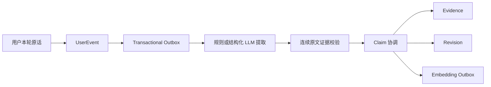

# Terrain Memory Engine V2

本文是当前代码的运行说明，不替代根目录的产品与技术基线。V2 已从影子链路切到正式召回（`MEMORY_V2_MODE=active`），但仍不覆盖旧表：Legacy 四层记忆原样保留，回滚只需把模式退回上一级。

> **与产品基线 V2 的关系**：根目录 [`内在地形-产品基线-v2.md`](../../内在地形-产品基线-v2.md) 已删除“共处自动生成待办”和“每次对话自动进入记忆河流”，并把产品核心改为带证据、可校正的“正在形成什么”。本文件描述的 UserEvent、Claim、Evidence、Revision、受控召回和删除墓碑继续作为工程地基；`/memos/detect`、`/pebbles` 等现有能力属于迁移期兼容面，不再自动等同于目标产品行为。

自 Phase 0 起，新客户端聊天默认 `confide`，不要求用户选择意图；请求中的 `mode=auto|memo|life` 仅供旧客户端迁移，`auto` 按 `confide` 处理。普通共处写 Working 和 Memory V2 UserEvent/Outbox，但不创建 Memo 或 Legacy Episodic；`memo`/`life` 只有在旧客户端明确传入时才保留对应兼容行为。共处和生活碎片都可以携带文字、图片或原始语音；ASR 转写只用于本轮理解或用户确认，原始文件在本地验证阶段保存于 F 盘媒体目录，显式 TTS 只在用户点击时生成。

当前对外契约不再暴露旧的意图选择和“不留痕”字段；普通共处统一由显式模式、用户设置和安全策略决定。`POST /moments` 只由“留下一刻”入口调用，保存用户原文及媒体；只有 `use_for_terrain=true` 时才进入 UserEvent/Outbox 证据链。

`GET /terrain` 是当前 Claim/Evidence 的只读产品投影，不是另一套记忆库。证据资格挂在来源行的 `UserEvent.terrain_eligible` 上，而不是 `source` 字符串上：显式授权的生活碎片和默认可用的共处轮次都可以成为材料（基线 8.2.1），敏感与危机内容在写入时就被排除。

只有形成层写出的 Claim（`source_type=formation`）才是地形；仅仅积累了证据、从未被命名的 Claim 作为**线索**出现在 `candidates` 里。线索的成熟门槛是至少 3 条独立支持证据、跨 7 天、来自至少 2 个会话或情境。接口不暴露小数置信度，只返回可理解的成熟度与证据范围。详见 [`memory-v3-formation.md`](./memory-v3-formation.md)。

## 当前默认状态

| 配置 | 默认值 | 行为 |
|---|---:|---|
| `MEMORY_V2_MODE` | `active` | 通过状态、时间与敏感度门禁的结果进入回复上下文 |
| `MEMORY_V2_EXTRACTOR_MODE` | `hybrid` | 结构化 LLM 提取 + 规则兜底；模型失败自动退回规则 |
| `MEMORY_V2_EMBEDDING_ENABLED` | `true` | 生产使用 pgvector HNSW；关闭会让形成层退化为单一 `recurring` |
| `MEMORY_V2_RETRIEVAL_TOPK` | `2` | 一次回复最多选择两条长期记忆 |

灰度期已结束：记忆是产品的核心差异点，影子模式下用户永远看不到"它记得我"，因此 `active` 是默认形态而不是实验开关。测试环境在 `tests/conftest.py` 里把抽取与向量钉成离线确定值（`rules` / `false`），需要验证这两条分支的用例自己构造 Settings。

生活碎片的回应 Outbox 属于独立的互动链路；`MEMORY_V2_MODE=off` 只关闭 UserEvent/Claim 抽取，仍会由同一 Worker 消费生活回应和回访回声，避免碎片永久停在 Pending。切换为 `off` 时，已经排队的提取/向量任务会显式标记为 `cancelled`，不会留下无法消费的 Pending。

模式按以下顺序降级（也是历史上的灰度顺序）：

1. `off`：完全关闭 V2；
2. `shadow_write`：可靠双写与异步抽取，不运行 V2 召回；
3. `shadow_retrieve`：运行召回并写 Trace，但不把结果放入模型上下文；
4. `active`：只有通过状态、时间和敏感度门禁的结果才进入回复上下文。

出问题时只需把模式退回上一级——`shadow_retrieve` 仍然照常召回并写 Trace，可观测性不受影响，只是一个字都不进回复。Legacy 表和接口保持不变，因此不需要反向搬迁数据。`tests/test_memory_active_recall.py` 同时钉住了 `active` 与 `shadow_retrieve` 两侧的行为。

## 写入算法



关键不变量：

- `UserEvent` 只保存用户输入；AI 回复、系统提示和危机模板不能成为用户事实证据。
- 每个 Atom 的 `evidence_text` 必须能在同一条用户原话中逐字定位；定位失败直接丢弃。
- 危机表达进入安全流程，不写长期 Claim。
- 低风险、明确表达且达到阈值的事实可以直接 `confirmed`；敏感内容、互动策略和推断内容保持 `proposed`。
- 用户对一条记忆选择 `reject` 或 `hide` 后，同一 `content_hash` 的后续提取会被跳过，不会以新的 Claim ID 重新出现；硬删除会同时移除这条抑制记录。
- 名字等单值槽出现新值时只创建待确认版本；旧值继续有效，直到用户确认新版本。
- 喜欢、目标、习惯等集合型事实可以并存，不能因为同属一个类别而互相覆盖。
- 每次创建、补证、冲突、确认、纠正、隐藏和替代都写 `MemoryRevision`。

Outbox 与 UserEvent 在同一个数据库事务中提交。Worker 使用有限批次、指数退避、最大重试次数和 `dead` 状态；Outbox 不复制用户正文，只保存事件 ID。

## 召回与遗忘

先由规则门判断本轮是否真的需要长期记忆。没有“记得、之前、最近、关系延续”等清晰信号时返回 `none`，避免为了表现聪明而强行提历史。

候选只允许 `confirmed` 或 `corrected`，并检查 `valid_from/valid_to`。当前评分为：

```text
base =
  0.30 * semantic
  + 0.18 * lexical
  + 0.15 * temporal
  + 0.10 * continuity
  + 0.10 * importance
  + 0.05 * pin
  + 0.12 * activation

final = base * confidence
```

`activation = (days_since_last_landed + 1)^-0.35`，每次按绝对时间重新计算，不在旧权重上重复衰减；置顶记忆的 activation 固定为 1。实际用于回复后更新 `last_landed_at`、`retrieval_count` 并写 `MemoryRetrievalTrace`。同一槽只取一个版本、同一类别最多两条、总数最多两条。

敏感 Claim 即使已确认，也必须同时满足用户允许主动引用和强相关匹配。无合格候选时返回空结果。

生产 PostgreSQL 使用 pgvector 原生 cosine `<=>` 排序，查询保持向量列不被 `CAST` 包裹，以便 HNSW 索引参与执行计划；SQLite 测试环境对有限候选在进程内计算 cosine。向量维度当前固定为 1024，Worker 会在落库前拒绝维度不符的提供方响应。

## 用户控制 API

所有路径位于 `/api/v1/memories`：

- `GET /`：列表、全文筛选、状态筛选、分类筛选和游标分页；
- `GET /{claim_id}`：查看 Claim；
- `GET /{claim_id}/evidence`：查看逐字证据；
- `PATCH /{claim_id}`：纠正内容、有效期、置顶与主动引用权限；
- `POST /{claim_id}/confirm|reject|defer|hide|restore`：执行受约束状态转换；`defer` 对应“暂时不知道”；
- `DELETE /{claim_id}`：同步硬删除该 Claim 的 Evidence、Revision、Embedding、关系和待处理索引任务。

`GET /me/profile` 还返回 `feedback.rejected_memory_count` 和最近校正时间，供客户端在“我们”页明确展示后续行为已经改变。

硬删除会写两类不可逆哈希墓碑：Claim 标识墓碑用于删除审计；Claim 与来源证据的绑定墓碑用于拦截延迟或重放的 Outbox，防止已删记忆复活。墓碑不保存用户正文。

当前单条记忆删除不会顺带删除原聊天记录，因为一条原话可能同时支撑多条仍有效的记忆。删除原始会话、账号全量删除、媒体清理和备份恢复后的墓碑重放仍需独立隐私任务实现。

## 本地验证

```powershell
Set-Location F:\every_day_progress\habit_list\habit_list_backend
& '..\.conda\python.exe' -m ruff check app\memory_v2 app\db\memory_models.py app\api\v1\memories.py --select E,F,I --ignore E501
& '..\.conda\python.exe' -m pytest
```

测试覆盖显式抽取、证据不可编造、多值事实并存、单值冲突待确认、敏感互动偏好、受控召回、召回 Trace、用户纠正、级联硬删除、Outbox 防复活、AI 回复不进入事实证据、语音原文件与转写、主动时刻权限、`active` 与 `shadow_retrieve` 两侧的回复注入行为，以及形成层的全部拒绝规则（`tests/test_memory_v3_formation.py`）和地形投影的线索/地形分界。

## 公开上线前尚未完成

- PostgreSQL/pgvector/Alembic 和独立 Worker 基础已经落地；仍需在目标服务器做容量、锁竞争、HNSW 执行计划、备份恢复与故障演练。
- Outbox 已使用 `FOR UPDATE SKIP LOCKED` 支持多 Worker 抢占，但周期调度任务在扩到多 Worker 前仍需数据库 leader lock 或全链路幂等审计。
- 正式用户身份、短期 Token、管理员 RBAC/MFA 与配置发布中心。
- 来源记录删除、账号全量导出/删除、媒体删除和备份墓碑重放。
- 真实数据集上的抽取准确率、引用命中率、敏感误召回率、成本与延迟评测。
- Legacy Semantic 的历史数据清洗；`active` 只放行 V2 的 Claim（`confirmed`/`corrected` 且证据来源仍活跃），Legacy Semantic 走的是另一条 `_semantic_to_prompt` 通道，其历史数据仍需单独审计。
