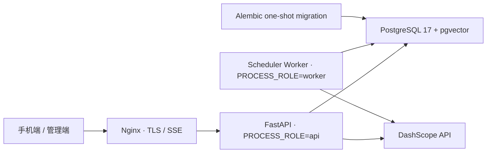

# 生产基础运行手册

> 状态：这是可持续演进的生产基础，不代表已经满足公开上线条件。正式用户鉴权、管理员 RBAC、账户删除闭环、监控告警与恢复演练仍是发布门槛。

## 运行拓扑



生产使用 PostgreSQL、Alembic 和独立 Worker。SQLite、`create_all` 与内嵌调度器只用于本地开发。

| 维度 | 本地开发 | 生产 |
|---|---|---|
| 数据库 | SQLite | PostgreSQL + pgvector |
| Schema | `auto_create` | `alembic` |
| 进程 | `PROCESS_ROLE=all` | `api` 与 `worker` 分离 |
| 启动文件 | `docker-compose.yml` | `docker-compose.production.yml` |
| 记忆策略 | 默认 `shadow_write` | 首发仍保持 `shadow_write` |

## 首次配置

1. 在服务器部署目录复制 `.env.production.example` 为 `.env.production`。
2. 替换所有 `replace_with...` 值；用户 token 与管理员 token 必须不同且至少 32 字符。
3. `POSTGRES_PASSWORD` 与 `DATABASE_URL` 中经过 URL 编码的密码必须一致。
4. `CORS_ALLOWED_ORIGINS` 只填写真实管理端 Origin；原生手机客户端不依赖 CORS。
5. `.env.production` 权限保持 `0600`，绝不提交到 Git。

应用会在生产启动时拒绝 SQLite、`auto_create`、`PROCESS_ROLE=all`、通配 CORS、弱 token 和占位 DashScope Key。

## 数据库迁移

生产服务启动前由 `migrate` 一次性容器执行：

```bash
docker compose --env-file .env.production \
  -f docker-compose.production.yml run --rm migrate
```

常用检查：

```bash
docker compose --env-file .env.production \
  -f docker-compose.production.yml run --rm migrate alembic current

docker compose --env-file .env.production \
  -f docker-compose.production.yml run --rm migrate alembic check
```

Schema 修改流程：修改 SQLAlchemy model，生成 revision，人工检查 upgrade/downgrade，在临时库演练，再进入评审。生产回滚优先回滚应用并使用前向修复迁移；不要在有真实数据时直接执行 `alembic downgrade base`。

首个迁移会创建 `vector` 扩展、1024 维向量列与 HNSW cosine 索引。改变嵌入维度需要单独的数据迁移和全量重嵌入，不能只改环境变量。

## 部署

首次服务器初始化：

```bash
bash deploy/provision_ubuntu.sh
```

从项目目录执行部署；脚本只接受 SSH key，不处理或记录 SSH 密码：

```bash
export DEPLOY_CONFIRM=inner-terrain-production
bash deploy/deploy.sh
```

脚本会先在本地校验 Compose，非删除式同步代码，将旧 `.env.production` 备份到远端 `.env-backups/`，再原子替换配置、构建并启动。它不会自动签发证书，也不会替代部署前数据库备份。

## 健康与排障

- `/health`：进程存活，返回当前角色，不探测数据库。
- `/ready`：数据库可用后才返回 200，可作为负载均衡就绪探针。
- Worker：容器内心跳文件必须处于 `running` 且未过期。
- `migrate`：正常状态是执行成功后退出码 0，不应常驻。

```bash
docker compose --env-file .env.production -f docker-compose.production.yml ps
docker compose --env-file .env.production -f docker-compose.production.yml logs --tail=200 app worker migrate
curl -fsS http://127.0.0.1:8780/ready
```

## 备份与恢复底线

每次迁移前至少创建 PostgreSQL custom-format 备份，并将备份放在数据库主机之外。首次真实上线前必须完成一次“新空库恢复 + 应用读取”的演练，并记录 RPO/RTO。命名卷不是备份。

## 公开上线前门槛

- 用用户 Session/OIDC 替换固定 Bearer token；管理员端实施独立身份、RBAC、审计日志与高风险操作二次确认。
- 完成账号注销、数据导出、证据/向量/派生记忆/日志的全链路删除验证。
- 配置 TLS 自动续期、WAF/限流、密钥轮换、依赖漏洞扫描与日志脱敏。
- 接入错误、延迟、模型成本、Outbox 堆积、Worker 心跳和 PostgreSQL 指标告警。
- 建立 PostgreSQL 自动备份、异地保留、恢复演练及发布回滚流程。
- 用真实 PostgreSQL 跑负载、并发 Outbox、迁移和故障恢复测试。
