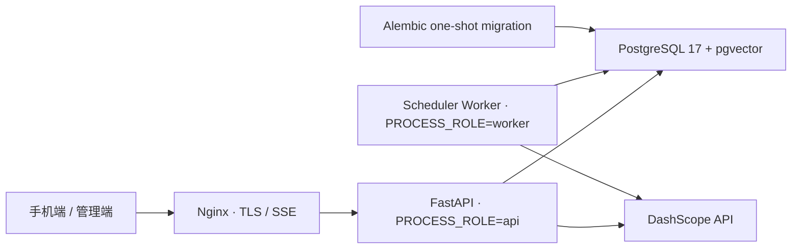

# 生产基础运行手册

> 状态：这是可持续演进的生产基础，不代表已经满足公开上线条件。用户会话与管理员 MFA/RBAC 已建立；账户删除闭环、限流告警、TLS 与恢复演练仍是发布门槛。

## 运行拓扑



生产使用 PostgreSQL、Alembic 和独立 Worker。SQLite、`create_all` 与内嵌调度器只用于本地开发。

| 维度 | 本地开发 | 生产 |
|---|---|---|
| 数据库 | SQLite | PostgreSQL + pgvector |
| Schema | `auto_create` | `alembic` |
| 进程 | `PROCESS_ROLE=all` | `api` 与 `worker` 分离 |
| 启动文件 | `docker-compose.yml` | `docker-compose.production.yml` |
| 记忆策略 | 默认 `shadow_write` | 首发仍保持 `shadow_write` |

所有服务使用 Docker `json-file` 日志轮转（单文件 10MB、最多 5 份），避免单机系统盘被容器日志无限占用。业务审计与长期可观测数据仍需进入独立持久化系统，不能把 Docker 日志当作审计存储。

当前 4GB 单机基线为 PostgreSQL 1GB、API 896MB、Worker 768MB、Nginx 128MB，并设置进程数上限；这些是防止单个容器拖垮主机的安全阀，不是容量结论。正式流量前仍需压测并根据 PostgreSQL、检索图和音频请求的峰值调整。

## 首次配置

1. 在服务器部署目录复制 `.env.production.example` 为 `.env.production`。
2. 替换所有 `replace_with...` 值；生成独立的 token pepper、PII Fernet key 与管理员 MFA Fernet key。
3. `POSTGRES_PASSWORD` 与 `DATABASE_URL` 中经过 URL 编码的密码必须一致。
4. `CORS_ALLOWED_ORIGINS` 只填写无路径的 HTTPS 管理端 Origin；原生手机客户端不依赖 CORS。
5. `DEPLOY_DOMAIN` 只能填写已经准备解析的真实 DNS 域名，不接受 IP、localhost 或示例域名。
6. `.env.production` 权限保持 `0600`，绝不提交到 Git。

应用会在生产启动时拒绝 SQLite、`auto_create`、`PROCESS_ROLE=all`、非 HTTPS/通配 CORS、legacy 鉴权、弱 pepper、相同或无效的 Fernet key、占位 Apple Client ID 和占位 DashScope Key。生产与 staging 环境不公开 OpenAPI、Swagger 或 ReDoc。

## 数据库迁移

生产服务启动前由 `migrate` 一次性容器执行：

```bash
docker compose --env-file .env.production \
  -f docker-compose.production.yml build app

docker compose --env-file .env.production \
  -f docker-compose.production.yml run --rm migrate
```

生产镜像只由 `app` 服务构建一次；`migrate` 与 `worker` 必须复用同一镜像，避免同一发布出现重复构建或依赖漂移。Dockerfile 将第三方依赖与业务代码分层，普通代码发布复用依赖层。

常用检查：

```bash
docker compose --env-file .env.production \
  -f docker-compose.production.yml run --rm migrate alembic current

docker compose --env-file .env.production \
  -f docker-compose.production.yml run --rm migrate alembic check
```

Schema 修改流程：修改 SQLAlchemy model，生成 revision，人工检查 upgrade/downgrade，在临时库演练，再进入评审。生产回滚优先回滚应用并使用前向修复迁移；不要在有真实数据时直接执行 `alembic downgrade base`。

首个迁移会创建 `vector` 扩展、1024 维向量列与 HNSW cosine 索引。改变嵌入维度需要单独的数据迁移和全量重嵌入，不能只改环境变量。

本地真实 PostgreSQL 联调使用隔离的 Compose project 和 18780 端口，不会占用开发服务的 8780 端口：

```bash
APP_ENV_FILE=.env.integration.example docker compose \
  -p inner-terrain-integration \
  --env-file .env.integration.example \
  -f docker-compose.production.yml \
  up -d --build postgres app worker

curl -fsS http://127.0.0.1:18780/ready
```

`.env.integration.example` 只含已知测试值，禁止复制到服务器。联调 project 的数据库卷也只用于测试，不可当作生产备份。

生产镜像采用构建上下文白名单，只向 Docker builder 提交运行代码、迁移与打包元数据；`.env.production`、测试、文档、日志和本地数据不会进入构建上下文或镜像层。

## 部署

首次服务器初始化：

```bash
bash deploy/provision_ubuntu.sh
```

从项目目录执行部署；脚本只接受 SSH key，不处理或记录 SSH 密码。Windows 上用 Git Bash 执行；默认读取仓库根目录下的专用密钥 `.secrets/ssh/inner-terrain-deploy`：

```bash
export DEPLOY_CONFIRM=inner-terrain-production
bash deploy/deploy.sh
```

首次正式发布前可执行只读 dry run；它验证本地 Compose、Git 归档、专用密钥、主机指纹、Docker Compose 与远端目录，但不创建远端 release：

```bash
export DEPLOY_CONFIRM=inner-terrain-production
export DEPLOY_DRY_RUN=1
bash deploy/deploy.sh
```

如需覆盖连接参数，显式设置 `SERVER_HOST`、`SERVER_USER`、`SSH_IDENTITY_FILE` 或 `REMOTE_DIR`。部署脚本拒绝发布未提交的后端改动；它以当前 Git commit 生成不含密钥、开发 Compose、集成配置和测试目录的归档，为每次发布创建 `/opt/habit_list_backend/releases/<release-id>`，就绪检查通过后才原子更新 `current`，并把上一版本保留在 `previous`。脚本不会自动删除旧 release、签发证书或替代迁移前数据库备份。

服务器初始化不会执行全系统 `apt upgrade`，也不会安装宿主机 Nginx。域名解析与 80 端口确认后，使用 Certbot webroot 模式签发证书：

```bash
sudo certbot certonly --webroot \
  -w /var/www/certbot \
  -d YOUR_DOMAIN \
  --email YOUR_EMAIL \
  --agree-tos --no-eff-email
```

签发前保持 Nginx 配置的 HTTPS 块关闭；签发后启用 443 与 HTTP 跳转、执行 `docker compose config` 并重新加载。不要在只有 IP、没有有效证书时开放用户流量。

需要回滚应用时，先确认新迁移仍与上一版本向后兼容，再进入 `/opt/habit_list_backend/previous`，重新构建该版本的 `app` 镜像并执行 `up -d --no-build`。数据库迁移默认不自动降级；若不兼容，应使用评审过的前向修复迁移。回滚完成且 `/ready` 正常后再更新 `current/previous` 指针。

## 健康与排障

- `/health`：进程存活，返回当前角色，不探测数据库。
- `/ready`：数据库可用后才返回 200，可作为负载均衡就绪探针。
- Worker：容器内心跳文件必须处于 `running` 且未过期。
- `migrate`：正常状态是执行成功后退出码 0，不应常驻。

```bash
docker compose --env-file .env.production -f docker-compose.production.yml ps
docker compose --env-file .env.production -f docker-compose.production.yml logs --tail=200 app worker migrate
curl -fsS http://127.0.0.1:8780/ready
```

## 备份与恢复底线

每次迁移前至少创建 PostgreSQL custom-format 备份，并将备份放在数据库主机之外。首次真实上线前必须完成一次“新空库恢复 + 应用读取”的演练，并记录 RPO/RTO。命名卷不是备份。

## 公开上线前门槛

- 完成真实 Apple 应用凭据联调、登录/刷新限流、管理员恢复机制与高风险操作二次确认。
- 完成账号注销、数据导出、证据/向量/派生记忆/日志的全链路删除验证。
- 配置 TLS 自动续期、WAF/限流、密钥轮换、依赖漏洞扫描与日志脱敏。
- 接入错误、延迟、模型成本、Outbox 堆积、Worker 心跳和 PostgreSQL 指标告警。
- 建立 PostgreSQL 自动备份、异地保留、恢复演练及发布回滚流程。
- 用真实 PostgreSQL 跑负载、并发 Outbox、迁移和故障恢复测试。
