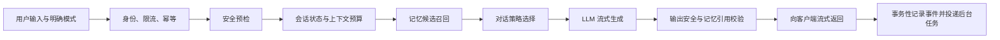
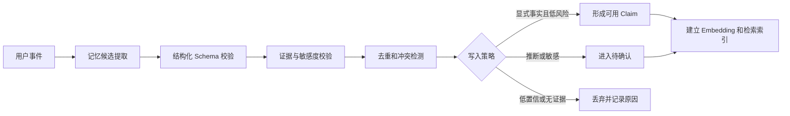
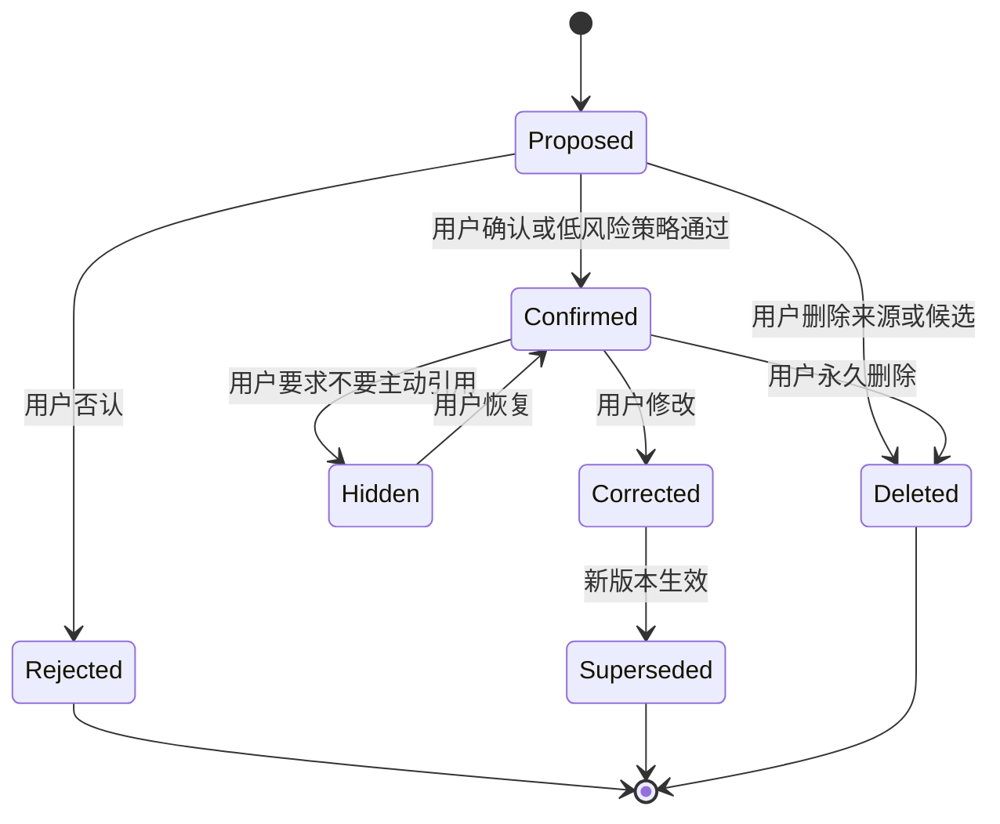
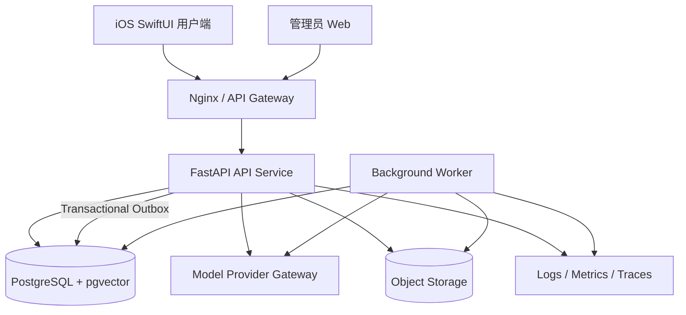

# 内在地形 · 产品与技术基线

> 版本：v0.6 Baseline Candidate  
> 日期：2026-08-01  
> 状态：待产品负责人确认后转为 Active  
> 适用范围：用户端、管理员端、后端、Agent、记忆系统、部署与质量体系  
> 历史依据：`产品设计文档.md` v0.5、现有 HTML 原型、`habit_list_backend` 单用户后端

---

## 0. 文档用途与优先级

本文档不是愿景草稿，而是后续产品与工程开发的统一基线，用来回答：

- 第一版为谁解决什么问题；
- 用户端和管理员端各自负责什么；
- Agent 如何回应、何时读取和写入记忆；
- 什么可以自动做，什么必须由用户确认；
- 数据如何存储、删除、审计和迁移；
- 如何部署、观测、评测和发布配置；
- 哪些能力属于 MVP，哪些明确延期。

发生冲突时，按以下优先级执行：

1. 用户安全、隐私和数据删除承诺；
2. 本基线文档；
3. 已发布的 OpenAPI、数据库迁移和配置版本；
4. 已确认的视觉规范与交互原型；
5. `产品设计文档.md` v0.5 及更早历史方案；
6. 现有原型或代码中的临时行为。

任何偏离本基线的长期决策，必须通过 ADR 或基线版本升级记录，不能只存在于聊天、代码注释或管理员配置中。

---

## 1. 一页结论

### 1.1 一句话定位

**内在地形是一款陪伴式自我记录 App：它听见用户的日常，把重要经历沉淀成可见、可改、可删除的记忆，并在合适的时候自然想起。**

### 1.2 核心价值

用户不是为了“完成记录”打开它，而是为了获得三个连续感受：

1. **此刻被听见**：回应贴合当下，不说教、不催促；
2. **之后被记住**：重要信息不会随着聊天窗口消失；
3. **长期被理解**：产品逐渐适应用户，但变化透明且可撤销。

### 1.3 第一版唯一必须打透的闭环

```text
用户说下一件真实的小事
  → 得到贴合当前状态的回应
  → 系统形成带证据的记忆候选
  → 用户可查看、确认、纠正或删除
  → 下一次在正确场景下被自然想起
  → 用户确认“它记得对”
```

第一版的“惊喜时刻”不是长回复、人格表演或复杂动画，而是：

> 用户使用 3～7 天后，AI 自然想起一件正确的事；用户能看到它从哪里得知，纠正后不会再次犯错。

### 1.4 产品形态

- **用户端**：iOS 原生 SwiftUI 优先，未来再评估 Android；
- **管理员端**：独立 Web 控制台，管理模型、Prompt、记忆策略、安全策略、功能开关、发布和质量；
- **服务端**：复用并演进现有 FastAPI 后端；
- **Agent**：有状态但受控的工作流，不采用开放式多 Agent 自主协作；
- **记忆**：四层认知记忆保留，但以证据、版本、权限和删除为核心重构；
- **部署**：私测期可单机容器化，数据层从 SQLite 迁至 PostgreSQL + pgvector。

### 1.5 明确不是

- 不是心理治疗或医疗诊断工具；
- 不是以连续打卡、惩罚、积分为核心的习惯工具；
- 不是无限主动、制造依赖或替代真实关系的“虚拟恋人”；
- 不是让模型任意调用工具和修改记忆的开放式自治 Agent；
- 不是让管理员直接浏览所有用户私密内容的运营后台。

---

## 2. 目标用户与用户任务

### 2.1 核心目标用户

第一阶段聚焦：

- 22～35 岁、独居或高压工作的年轻用户；
- 有自我成长意愿，但难以坚持正式日记；
- 有倾诉和整理生活的需求，但不喜欢任务化、说教式产品；
- 愿意用文字或语音留下日常碎片；
- 对隐私、错误记忆和 AI 越界较敏感。

### 2.2 核心用户任务

| 场景 | 用户真正想完成的事 | 产品行为 |
|---|---|---|
| 情绪或事件发生后 | 找到一个低门槛出口 | 快速进入倾诉，先接住再回应 |
| 怕忘记某件事 | 把脑内负担暂时放下 | 用户明确选择备忘模式，系统提取时间并让用户确认 |
| 想留下生活片段 | 保存当下而非写完整日记 | 文字、图片或语音形成生活石子 |
| 回看一段时间 | 看见自己的变化和重复模式 | 记忆河、洞察、周信件提供带证据的回看 |
| AI 记错或说得不对 | 立即恢复控制感 | 查看依据、纠正、撤销或永久删除 |
| 想改变相处方式 | 让产品适应自己 | 显式设置 + 透明的隐式学习轨迹 |

### 2.3 暂不扩张的人群

MVP 不针对未成年人、临床心理治疗场景、企业员工监控、家庭成员共享画像或高风险医疗决策场景设计。

---

## 3. 产品原则

### P1. 记得准确，比记得更多重要

错误引用一次，可能抵消十次温柔回应。长期记忆默认保守写入、证据可追溯、敏感信息不自动升层。

### P2. 陪伴不等于操控依赖

不使用“只有我懂你”“我永远不会离开”“不要去找别人”等排他、拟人欺骗或依赖强化话术。产品必须明确自己是 AI，并鼓励用户保留真实关系和现实支持网络。

### P3. 用户选择模式，系统不越权分类

共处输入区由用户选择 `倾诉 / 备忘 / 生活`。系统可以给极弱提示，但不得在后台悄悄改变类别。

### P4. 记忆与角色解耦

记忆保存关于用户的中性信息；角色只决定表达方式。切换角色或调整语气不得导致失忆，也不得改写事实。

### P5. 记忆可见、可改、可导出、可永久删除

用户能够查看 AI 记住了什么、依据哪些记录、何时形成、是否被使用，以及如何纠正或删除。

### P6. 自适应必须透明且可撤销

回复长度、节奏、主动程度等变化要有理由、版本和回滚能力。用户显式设置始终高于隐式学习。

### P7. 隐私默认最小化

只采集完成产品功能所需的数据；日志默认脱敏；管理员默认不可见私密正文；API Key 永不下发客户端。

### P8. 确定性负责边界，模型负责理解

鉴权、权限、删除、安全路由、幂等、配置发布由代码和数据约束保证；模型负责语言理解、候选提取和自然表达。

---

## 4. 成功定义与指标

### 4.1 北极星指标

**被正确记住的周活跃用户占比（Weekly Correctly Remembered Users, WCRU）**

定义：满足以下条件的周活跃用户占可评估周活跃用户的比例：

- 一周内至少产生 3 条有效记录；
- 至少收到 1 次自然的历史记忆引用；
- 该引用被抽样反馈为“记得对”，且 7 天内未被纠正或删除。

### 4.2 记忆质量指标

| 指标 | 定义 | Alpha 目标 |
|---|---|---|
| 记忆引用正确率 | 标记正确的引用 / 有反馈的引用 | ≥ 90% |
| 错误记忆伤害率 | 被用户标记为冒犯、错误或不应记住的引用 / 全部引用 | ≤ 2% |
| 记忆候选接受率 | 确认候选 / 已处理候选 | ≥ 70% |
| 纠正复发率 | 被纠正后 30 天内再次以旧版本引用的事实比例 | < 1% |
| 删除违规率 | 删除后仍被检索、展示或用于洞察的记录比例 | 0 |
| 无依据推断率 | 无有效用户证据的 Semantic/Procedural 候选比例 | < 1% |

### 4.3 产品指标

- 新用户首次有效记录完成率；
- 第 3 次会话完成率；
- D7 / D30 留存；
- 每周有效记录天数；
- 记忆河回访率；
- 用户主动纠正和删除的完成率；
- 主动消息关闭率和打扰投诉率。

### 4.4 工程护栏

- 安全路由漏判率；
- P95 首字延迟、完整回复延迟；
- 模型调用失败率和降级成功率；
- 单活跃用户日均模型成本；
- 配置发布回滚率；
- 隐私导出和删除请求完成时长。

---

## 5. 用户端信息架构

保留现有五个底部入口，统一为当前原型已形成的结构：

| Tab | 用户心智 | MVP 职责 | 非 MVP |
|---|---|---|---|
| 共处 | “现在有人听我说” | 三模式输入、对话、语音转文字、当前会话 | 多角色群聊、开放式工具执行 |
| 生活 | “留下今天的一点东西” | 图/文/音生活碎片、月份浏览、编辑删除 | 视频、公开分享、社交动态 |
| 备忘 | “替我捧住别忘的事” | 时间与重要度确认、本地通知、完成与延期 | 复杂项目管理、多人协作、地点自动化 |
| 河·见 | “它记得什么，我看见了什么” | 记忆河、记忆候选、洞察、证据与纠错 | 自由星图、复杂知识图谱可视化 |
| 它 | “我们怎么相处” | AI 身份说明、风格参数、学习轨迹、隐私与数据权利 | 角色商城、人格社交、付费装扮 |

### 5.1 共处页三模式

#### 倾诉模式 `confide`

- 默认模式；
- 输入文字或语音；
- AI 先回应当前状态，再决定是否自然引用记忆；
- 不自动创建备忘；
- 重要事实只能形成记忆候选，不直接成为高置信事实。

#### 备忘模式 `memo`

- 用户明确选择后才创建备忘；
- 时间、重要度和提醒方式必须在客户端可见；
- 时间解析不确定时，先保存草稿并请求轻量确认；
- 创建成功后立即注册本地通知；
- 备忘同时可以形成 Episodic，但不自动推断人格或健康事实。

#### 生活模式 `life`

- 支持文字、图片、语音或组合；
- 媒体上传与 AI 理解分离，上传失败不能丢失本地草稿；
- 图片描述只作为候选元数据，不得冒充用户陈述；
- 生活碎片进入记忆河，但默认不自动升为敏感 Semantic。

### 5.2 第一次使用

首次引导只完成四件事：

1. 明确这是 AI 陪伴产品，不是人类或治疗师；
2. 解释三种记录模式；
3. 告知“它记住的内容可查看、纠正和删除”；
4. 获得必要的隐私、通知和语音权限授权。

不在首次打开时进行长问卷。前 3 次有效会话后，再以可跳过的方式询问：

- 希望它偏温柔、直接还是轻松；
- 偏好短回应还是可以展开；
- 是否允许主动问候，默认关闭。

### 5.3 记忆引用交互

当回应引用长期记忆时：

- 文案自然，不显示内部评分；
- 提供不打断阅读的“为什么记得”入口；
- 展开后显示事实、证据记录、形成时间和状态；
- 提供 `记得对 / 不准确 / 不要再提 / 永久删除`；
- 用户纠正后，本轮后续回复立刻使用新版本。

### 5.4 主动陪伴

MVP 默认关闭主动聊天，只开放：

- 用户明确创建的备忘通知；
- 用户主动开启的每周信件；
- 用户配置时间窗内、低频且可一键关闭的问候实验。

任何主动消息都必须通过频率上限、静默时段、最近情绪、安全状态和用户授权检查。

---

## 6. 管理员端产品基线

管理员端是**控制面和质量面**，不是用户私密内容浏览器，也不是数据库编辑器。

### 6.1 角色与权限

| 角色 | 能力 | 禁止 |
|---|---|---|
| Super Admin | 管理管理员、密钥引用、全局发布和紧急停用 | 直接查看完整密钥、绕过审计 |
| Product Operator | 管 Prompt、角色文案、功能开关、灰度人群 | 查看用户原始对话、修改数据库 |
| Safety Reviewer | 管安全策略、匿名化案例和误判复核 | 浏览无关用户信息、导出原始数据 |
| Support | 查看账号状态、用户主动提交的支持材料 | 默认读取历史对话或记忆正文 |
| Analyst | 查看聚合指标、成本和质量报表 | 访问可识别个人的原始数据 |

### 6.2 配置中心

必须支持以下配置域：

- 模型路由：对话、记忆提取、洞察、Embedding、ASR、安全分类；
- Prompt Bundle：系统 Prompt、模式 Prompt、记忆使用规则、安全补充；
- 记忆策略：阈值、召回 TopK、上下文预算、敏感类别、衰减参数；
- 角色与表达：默认角色、语气范围、禁止话术；
- 功能开关：版本、用户分组、平台、地区、最低客户端版本；
- 通知策略：类型、时间窗、频率上限、模板；
- 成本策略：单请求、单用户、单日预算和降级模型；
- 安全策略：危机等级、地区资源、响应模板、人工复核规则。

### 6.3 发布流程

```text
草稿
  → Schema 校验
  → 自动回归评测
  → 内部测试环境
  → 小流量灰度
  → 全量发布
  → 持续监控或一键回滚
```

每个发布版本必须记录：

- `release_id`；
- 配置差异；
- Prompt 和模型版本；
- 创建人、审批人、发布时间；
- 灰度范围；
- 自动评测结果；
- 回滚目标；
- 关联事故或变更说明。

保存草稿不得自动影响线上。生产配置不可直接原地修改，只能发布新版本。

### 6.4 运营与质量页面

MVP 管理员端只做：

1. 模型与 Prompt 配置；
2. 记忆策略与安全策略；
3. 发布、灰度与回滚；
4. 延迟、错误、成本、记忆正确率和安全指标；
5. 后台任务状态与失败重试；
6. 用户导出、删除、封禁等合规工单；
7. 审计日志。

不做用户聊天全文搜索、不做直接 SQL、不做“代替用户修改记忆”的隐形操作。

---

## 7. Agent 基线

### 7.1 设计选择

第一版采用**单一受控 Agent Runtime + 专用异步任务**，不采用开放式多 Agent。

原因：

- 陪伴对话需要稳定人格和低延迟；
- 记忆写入、安全和删除必须可追踪；
- 多 Agent 会放大成本、延迟、重复推断和不可解释性；
- 当前真正难点是记忆正确率，而不是任务规划复杂度。

### 7.2 实时工作流



#### 步骤职责

1. **身份、限流、幂等**：验证用户与设备，拒绝重复消息；
2. **安全预检**：规则 + 分类模型识别危机、违法和滥用风险；
3. **上下文构造**：读取当前会话、用户显式偏好和受预算约束的长期记忆；
4. **记忆召回**：返回带来源、状态和安全级别的候选，不返回已删除或被拒绝内容；
5. **对话策略**：决定回应长度、是否引用记忆、是否提问、是否保持简短；
6. **生成**：模型只接收本轮所需最少上下文；
7. **输出校验**：检查危机话术、禁止承诺、事实引用和工具结果；
8. **持久化**：完成用户事件和 Agent Run 的事务写入，再可靠投递记忆提取任务。

### 7.3 异步工作流



### 7.4 Agent 工具边界

允许的受控工具：

- `memory.search`：只读检索；
- `memory.explain`：读取证据链；
- `memory.propose`：提交候选，不能直接覆盖已确认事实；
- `memo.create/update`：仅在用户选择备忘模式或明确要求时；
- `life.create`：保存生活碎片；
- `notification.schedule/cancel`：需用户授权；
- `profile.read`：读取显式配置；
- `safety.route`：进入安全响应状态。

禁止模型直接执行：

- 删除用户全部数据；
- 修改权限、身份或管理员配置；
- 直接发布 Prompt 或模型配置；
- 将推断写成用户确认事实；
- 向第三方发送用户内容；
- 绕过安全状态或用户授权。

### 7.5 Prompt 管理

Prompt 不散落在 Python 常量中。每次运行引用一个不可变 `prompt_bundle_version`，至少包含：

- `identity`：AI 身份、产品边界；
- `conversation_policy`：通用回应原则；
- `mode_confide` / `mode_memo` / `mode_life`；
- `memory_usage_policy`：何时引用、如何表达不确定；
- `safety_policy`；
- `output_schema`；
- `forbidden_patterns`；
- `fallback_copy`。

Prompt 发布必须经过固定评测集，运行日志只记录版本和安全摘要，不记录完整敏感 Prompt 上下文。

---

## 8. 记忆 OS v0.6

### 8.1 四层模型继续保留

| 层级 | 定义 | 生命周期 | 是否直接注入 | 用户控制 |
|---|---|---|---|---|
| Working | 当前会话状态、最近轮次、未完成草稿 | 会话级，摘要后清理 | 是，受预算限制 | 可清空会话 |
| Episodic | 用户真实发生或明确记录的一次经历 | 长期，随用户删除 | 通过检索 | 可编辑、隐藏、删除 |
| Semantic | 从多个用户证据形成的稳定事实或阶段性事实 | 有版本和有效期 | 高置信且相关时 | 可确认、纠正、撤销、删除 |
| Procedural | 用户希望 AI 如何互动的偏好 | 直到修改或撤销 | 作为策略参数 | 显式设置最高优先级 |

### 8.2 关键修订：内容账本与审计账本分离

现有“Raw Ledger 永不删除且保存正文”的设计与用户永久删除承诺冲突。v0.6 调整为：

- **用户内容表**：保存可编辑、可导出、可删除的原始内容；
- **审计事件表**：append-only，只保存操作类型、资源 ID、时间、操作者和结果，不永久保存已删除正文；
- **派生数据**：Claim、Embedding、Insight、缓存和图关系必须记录来源，随来源删除或重新计算；
- **删除墓碑**：可以保留不可逆的资源 ID 哈希和删除完成状态，用于防止数据复活，但不能恢复正文。

### 8.3 Memory Claim 最小字段

| 字段 | 含义 |
|---|---|
| `claim_id` | 稳定 ID |
| `user_id` | 所属用户，所有查询强制过滤 |
| `claim_type` | semantic / procedural |
| `category` | 身份、偏好、关系、习惯、健康、目标、互动偏好等 |
| `claim_text` | 中性、简短、可展示的事实文本 |
| `source_type` | user_explicit / system_inferred / user_confirmed |
| `confidence` | 模型或规则置信度，不代表用户认可 |
| `user_status` | proposed / confirmed / corrected / rejected / hidden / deleted |
| `valid_from` / `valid_to` | 事实的有效时间范围 |
| `sensitivity` | normal / private / sensitive / crisis |
| `evidence_count` | 有效证据数量 |
| `supersedes_claim_id` | 新事实替代的旧版本 |
| `created_by_policy_version` | 形成该 Claim 的策略版本 |
| `created_at` / `updated_at` | 时间戳 |

证据必须存入独立 `memory_evidence`：

```text
claim_id
event_id
evidence_role: supports / contradicts / corrects
excerpt_start / excerpt_end 或结构化字段引用
created_at
```

### 8.4 写入规则

#### 可以直接成为可用 Claim

- 用户明确表达且低敏感的稳定偏好；
- 用户在设置页显式选择的互动参数；
- 用户主动确认的候选；
- 多条独立用户证据支持、结构化校验通过且策略允许的低风险事实。

#### 必须等待用户确认

- 对关系、健康、人格、财务、位置、宗教、政治或性相关内容的推断；
- 仅由单条含糊表达形成的长期事实；
- 与现有已确认事实冲突的内容；
- 会显著改变 Agent 主动程度、语气或安全策略的偏好；
- 从图片识别、ASR 不确定结果或外部数据推断的内容。

#### 永不作为用户事实的证据

- AI 自己生成的回复；
- 无法关联到用户事件的模型总结；
- 被用户拒绝、隐藏或删除的内容；
- 测试数据、管理员演示数据或公共知识；
- 危机模板和安全系统文案。

### 8.5 状态转换



### 8.6 检索规则

候选生成至少包含：

- Semantic 向量检索；
- BM25 / 全文检索；
- 最近 7 天 Episodic；
- 当前主题连续性；
- 用户置顶或最近纠正的事实；
- 与当前模式匹配的记录。

默认评分基线：

```text
base_score =
  0.35 * semantic_similarity
  + 0.20 * lexical_similarity
  + 0.15 * recency
  + 0.15 * importance
  + 0.10 * conversation_continuity
  + 0.05 * user_pin

final_score = base_score
  * claim_confidence
  * status_gate
  * safety_gate
```

规则要求：

- `deleted/rejected/superseded` 的权重必须为 0；
- `proposed` 不得以确定语气引用；
- 敏感内容只有当前语境明确需要且策略允许时才可召回；
- 同一回复最多自然引用 1～2 条长期记忆；
- 无高质量候选时宁可不提历史；
- 每次实际引用都记录 `retrieval_trace`，便于解释和评测。

### 8.7 遗忘与“捞起”

遗忘只影响检索优先级，不影响用户能否在记忆河中找到记录。

权重按“距上次被使用或用户查看的绝对时间”重新计算，不能每天在旧权重上重复乘以完整时间跨度：

```text
weight = min_weight + (1 - min_weight) * exp(-lambda * days_since_last_landed)
```

- 用户查看、确认、编辑或主动搜索到该记忆时，更新 `last_landed_at`；
- 用户置顶时不衰减；
- Semantic 的衰减速度慢于 Episodic；
- 视觉淡化是可选表现，不得让用户误以为内容即将丢失。

### 8.8 冲突处理

冲突不是简单判断谁真谁假，而是支持时间变化：

- “以前喜欢跑步，现在不跑了”应形成有效期不同的两个版本；
- 新 Claim 使用 `supersedes_claim_id` 指向旧版本；
- 无法确定时进入待确认，不自动选择；
- 用户确认当前版本后，旧版本仍可在历史中查看，但不得用于当前回应；
- 冲突检测结果必须保留双方证据。

### 8.9 永久删除契约

用户永久删除后：

1. API 立即返回删除任务 ID，前端立即隐藏；
2. 主库原始内容、Claim、Evidence、Embedding、Insight 和缓存立即失效；
3. 15 分钟内完成在线派生数据清理；
4. 对象存储和媒体缩略图进入删除队列；
5. 备份按保留周期自然过期，恢复备份时必须重放删除墓碑；
6. 审计只保留删除动作和不可逆资源标识，不保留正文；
7. 删除完成后，该内容不得再次进入检索、洞察、周报或模型上下文。

---

## 9. 技术架构基线

### 9.1 总体架构



### 9.2 服务边界

#### User API

- 用户身份、会话、聊天流式接口；
- 记忆、备忘、生活、洞察和个人设置；
- 媒体上传签名；
- 隐私导出和删除；
- 客户端版本与功能开关读取。

#### Admin API

- 独立 `/admin/v1` 命名空间；
- 独立认证、授权和限流；
- 配置草稿、校验、发布、灰度和回滚；
- 聚合指标、任务状态、审计和隐私工单；
- 不复用用户 Bearer Token，不通过“更强 Token”冒充任意用户。

#### Worker

- 记忆提取、巩固和冲突检测；
- Embedding 生成和重建；
- 洞察、周信件和通知任务；
- 媒体派生处理；
- 删除、导出和备份墓碑任务；
- 失败重试、死信和幂等。

MVP 使用 PostgreSQL Transactional Outbox + `jobs` 表驱动 Worker，不立即引入 Redis。出现吞吐或调度瓶颈后，再通过 ADR 引入专用队列。

### 9.3 技术选型

| 领域 | 基线选择 | 说明 |
|---|---|---|
| iOS | SwiftUI + Swift Concurrency | 与现有产品方向一致，适合原生通知、语音、相机与细腻动效 |
| Admin | React + TypeScript | 无 SEO 要求，优先稳定表单、权限和数据可视化 |
| API | FastAPI + Pydantic | 复用现有代码与测试资产 |
| ORM / Migration | SQLAlchemy 2 + Alembic | 禁止依赖启动时隐式建表作为生产迁移方式 |
| Database | PostgreSQL | 多用户、事务、并发、审计与迁移能力 |
| Vector | pgvector | 与业务数据同事务边界，降低早期系统复杂度 |
| Background Jobs | PostgreSQL Outbox + Worker | 先保证可靠性，再按规模拆队列 |
| Media | S3 兼容对象存储 / OSS 适配层 | 客户端直传签名 URL，服务端不长期中转大文件 |
| Reverse Proxy | Nginx | 复用当前部署方式，关闭 SSE 缓冲 |
| Runtime | Docker Compose（Alpha） | 单机私测，服务边界保持可拆分 |
| Observability | JSON Logs + Metrics + Traces | 每次 Agent Run 可还原模型、Prompt、配置和检索路径 |

### 9.4 数据表基线

核心表按领域划分：

#### Identity

- `users`
- `user_identities`
- `devices`
- `sessions`
- `refresh_tokens`

#### Conversation and Content

- `conversation_threads`
- `conversation_turns`
- `user_events`
- `media_assets`
- `memos`
- `life_fragments`

#### Memory

- `memory_claims`
- `memory_evidence`
- `memory_revisions`
- `memory_embeddings`
- `memory_retrieval_traces`
- `insights`

#### Agent and Cost

- `agent_runs`
- `model_calls`
- `usage_events`
- `outbox_events`
- `jobs`

#### Control Plane

- `prompt_bundles`
- `config_drafts`
- `config_releases`
- `feature_flags`
- `admin_users`
- `admin_roles`
- `audit_events`
- `privacy_requests`

所有用户内容表必须：

- 以 `user_id` 作为强制过滤条件；
- 使用数据库外键和唯一约束；
- 支持删除状态与删除任务关联；
- 有 `created_at`、`updated_at` 和必要的版本字段；
- 不使用 JSON 字段替代关键查询字段；
- JSON 只承载可演进的低频扩展元数据。

---

## 10. API 契约基线

### 10.1 通用要求

- OpenAPI 是客户端契约来源；
- 用户 API 和管理员 API 分离；
- 写接口支持 `Idempotency-Key`；
- 所有请求带 `X-Request-ID`，服务端返回同一值；
- 错误统一为机器码、用户消息、可选详情和请求 ID；
- 时间统一存 UTC，展示时使用用户时区；
- 分页使用 cursor，不使用不稳定的深 offset；
- 任何返回对象不得包含服务端密钥、内部 Prompt 或完整模型调试上下文。

### 10.2 用户聊天请求

推荐新接口：

```http
POST /api/v1/chat/stream
Authorization: Bearer <short-lived-access-token>
Idempotency-Key: <client-message-id>
Accept: text/event-stream
```

```json
{
  "client_message_id": "uuid",
  "session_id": "uuid-or-null",
  "mode": "confide",
  "content": [
    {"type": "text", "text": "今天有点累"}
  ],
  "client_context": {
    "locale": "zh-CN",
    "timezone": "Asia/Shanghai",
    "app_version": "0.1.0"
  }
}
```

`mode` 必填且只能是：

- `confide`
- `memo`
- `life`

服务端不得根据文本覆盖用户选择的模式。

### 10.3 SSE 事件

| 事件 | 作用 |
|---|---|
| `meta` | 返回 session、message、run、Prompt 和配置版本等非敏感元数据 |
| `delta` | 增量回复文本 |
| `action_preview` | 备忘时间、通知等需要用户确认的动作预览 |
| `memory_reference` | 本轮使用了哪些可解释记忆，仅返回展示所需字段 |
| `done` | 最终文本、用量摘要和落库状态 |
| `error` | 稳定错误码、是否可重试、降级状态 |

每个流必须以 `done` 或 `error` 结束。模型失败时也必须完成用户事件落库，并给出受控降级回复或明确可重试状态。

### 10.4 记忆 API

```text
GET    /api/v1/memories
GET    /api/v1/memories/{id}
PATCH  /api/v1/memories/{id}
POST   /api/v1/memories/{id}/confirm
POST   /api/v1/memories/{id}/reject
POST   /api/v1/memories/{id}/hide
DELETE /api/v1/memories/{id}
GET    /api/v1/memories/{id}/evidence
```

删除接口返回 `privacy_request_id` 或 `deletion_job_id`，前端可查询完成状态。

### 10.5 隐私 API

```text
POST /api/v1/privacy/exports
GET  /api/v1/privacy/exports/{id}
POST /api/v1/privacy/deletions
GET  /api/v1/privacy/deletions/{id}
```

### 10.6 管理员 API

```text
/admin/v1/auth/*
/admin/v1/config-drafts/*
/admin/v1/config-releases/*
/admin/v1/prompt-bundles/*
/admin/v1/feature-flags/*
/admin/v1/metrics/*
/admin/v1/jobs/*
/admin/v1/privacy-requests/*
/admin/v1/audit-events/*
```

管理员接口不得与用户接口共享固定 Token 或默认用户身份。

---

## 11. 模型与供应商基线

### 11.1 Provider Gateway

业务代码依赖统一接口，不直接依赖某个模型名称：

```text
ConversationProvider.stream()
StructuredGenerationProvider.generate(schema)
EmbeddingProvider.embed()
SpeechToTextProvider.transcribe()
ModerationProvider.classify()
TextToSpeechProvider.synthesize()  # 非 MVP
```

每次调用必须记录：

- provider、model、region；
- prompt bundle 和 config release；
- request / trace ID；
- latency、retry、timeout；
- input / output token；
- 估算成本；
- 结构化输出校验结果；
- 安全分类摘要。

日志禁止记录 API Key 和默认禁止记录完整用户正文。

### 11.2 默认模型角色

模型名称通过管理员配置发布，代码只提供安全默认值。基线候选：

| 任务 | 选择原则 |
|---|---|
| 实时对话 | 中文自然度、低延迟、流式稳定、指令遵循 |
| 记忆候选提取 | 支持结构化输出、低温度、成本低、稳定复现 |
| 洞察与周信件 | 可使用更强模型，但必须异步、限额、带证据 |
| Embedding | 中文召回稳定、维度固定、版本可追踪 |
| ASR | 中文口语与噪声环境表现、文件时长与格式支持 |
| 安全分类 | 延迟低、召回优先、支持规则兜底 |

截至 2026-08-01 的默认评测候选：

- 对话：`qwen3.7-plus`；
- 轻量结构化任务：当前支持结构化输出的 Flash/Plus 模型中择优；
- 文本 Embedding：`text-embedding-v4`；
- ASR：在 Paraformer 与当前 Qwen ASR 中做中文实测后选择；
- TTS：不进入 MVP。

模型 ID、区域和接口必须在部署前通过官方目录与真实 API 烟测确认。Embedding 模型或维度变化必须创建新版本并全量重建索引，禁止新旧向量混用。

### 11.3 结构化输出

记忆提取、动作预览、安全分类和洞察生成必须使用 Schema 驱动的结构化输出：

- 严格验证字段、枚举、长度和数值范围；
- 解析失败按可重试错误处理，不用正则“修 JSON”后静默接受；
- 模型返回的 evidence ID 必须属于本次允许的候选集；
- 无效输出不得写入长期记忆；
- 失败样本进入匿名化评测集。

### 11.4 超时、重试和降级

| 调用 | 超时基线 | 重试 | 降级 |
|---|---:|---:|---|
| 对话首包 | 8 秒 | 最多 1 次，仅连接类错误 | 短安全回复或明确重试 |
| 对话完整 | 30 秒 | 流开始后不自动重放 | 保留已生成文本并结束流 |
| Embedding | 10 秒 | 2 次指数退避 | 延迟建索引，不阻塞对话 |
| 记忆提取 | 30 秒 | 2 次 | 任务重排队，不写不完整记忆 |
| ASR | 按时长分级 | 1 次 | 保留本地音频草稿，允许重试 |

只有网络错误、超时和明确的 5xx 可重试；鉴权、配额、Schema 和安全错误不得盲目重试。

---

## 12. 安全、隐私与信任基线

### 12.1 身份与鉴权

#### 用户端

- Alpha 默认 Sign in with Apple；如增加其他平台登录，再评估手机号或邮箱 OTP；
- Access Token 短期有效，Refresh Token 可撤销并与设备绑定；
- 服务端从签名身份得到 `user_id`，不得从客户端参数接受任意用户 ID；
- 所有数据库访问强制附带当前 `user_id`；
- 支持设备列表、退出单设备和退出全部设备。

#### 管理员端

- 独立管理员身份系统；
- 强制 MFA；
- RBAC 最小权限；
- 高风险操作二次确认；
- 发布、回滚、密钥轮换和隐私操作全部审计；
- 生产环境可增加 VPN、IP Allowlist 或零信任访问层。

### 12.2 密钥管理

- DashScope、数据库、对象存储和管理员密钥只存在服务端；
- iOS 和 Admin Web 只能持有公开客户端配置和自己后端的短期 Token；
- `.env.example` 只包含占位符；
- 本地部署凭据与后端运行密钥分离；
- 生产密钥由服务器 Secret 文件、Docker Secret 或云 Secret Manager 注入；
- 管理员端只展示密钥名称、状态和末尾少量掩码，不回显完整值；
- 密钥支持轮换、双 Key 过渡和吊销；
- 任何曾进入前端源码的 Token 视为已泄漏并立即轮换。

### 12.3 数据保护

- 全链路 HTTPS；
- 数据库和对象存储启用静态加密；
- 高敏感字段支持应用层信封加密；
- 日志、追踪和错误上报默认脱敏；
- 不把原始对话作为指标标签；
- 数据导出使用短时效、一次性下载链接；
- 媒体上传使用限定类型、大小和时效的签名 URL；
- 备份加密并定期验证恢复；
- 对外发布前完成数据地域、隐私政策、用户协议和第三方处理者评估。

### 12.4 危机与高风险内容

危机流程优先于角色和普通记忆：

1. 本地规则识别极高风险表达；
2. 安全分类模型补充判断；
3. 进入专用安全状态，不继续普通角色表演；
4. 使用简洁、尊重且不做虚假承诺的回应；
5. 鼓励联系现实中的可信任对象和当地紧急支持；
6. 根据用户地区展示经过维护的援助资源；
7. 默认不把危机内容提炼成人格、健康洞察或周信件素材；
8. 记录安全事件等级和策略版本，不在普通日志记录完整正文。

禁止话术包括但不限于：

- 保证“永远不会离开”；
- 暗示只有 AI 能理解用户；
- 诊断心理或精神疾病；
- 因用户离开 App 而内疚施压；
- 用拟人关系阻止用户寻求现实帮助。

### 12.5 管理员查看用户内容

默认规则：

- 管理员看聚合指标，不看正文；
- 用户发起支持请求时，只共享用户主动选择的片段；
- 安全复核使用脱敏案例；
- 极少数 break-glass 访问需要双人审批、限定时间、限定资源并完整审计；
- 用户可在隐私说明中看到哪些场景可能产生人工访问。

---

## 13. 部署基线

### 13.1 Alpha 单机拓扑

第一阶段复用现有服务器和 Docker Compose，但服务拆分为：

```text
nginx
api
worker
postgres + pgvector
admin-web
backup-job
```

媒体优先使用对象存储；如果 Alpha 临时使用本地持久卷，必须通过统一 Storage Adapter，后续迁移不得影响业务代码。

### 13.2 服务要求

- Nginx 强制 HTTPS；
- SSE 路由关闭缓冲和缓存；
- API 与 Worker 分进程，后台任务不在 API 生命周期中 fire-and-forget；
- 数据库不直接暴露公网端口；
- 容器使用健康检查和 restart policy；
- 每次部署记录应用版本、数据库版本和配置 release；
- 数据库迁移先执行兼容性检查，再滚动服务；
- 失败时可回滚应用，但数据库迁移必须使用前向兼容策略。

### 13.3 环境分层

至少区分：

- `local`：开发者本地，模拟或测试模型；
- `test`：自动化测试，全部使用虚构用户与 Mock；
- `staging`：真实部署拓扑、隔离数据和隔离 Key；
- `prod`：真实用户数据，严格权限和审计。

禁止 staging 和 prod 共用数据库、对象存储 Bucket、管理员账号或 API Key。

### 13.4 备份与恢复

- PostgreSQL 每日全量备份 + 持续归档或更高频增量；
- 对象存储启用版本与生命周期策略；
- 备份加密并存放在独立权限域；
- 每月至少做一次恢复演练；
- 恢复后重放永久删除墓碑；
- Alpha 目标 RPO ≤ 24 小时、RTO ≤ 4 小时；
- 公测前重新评估并收紧目标。

### 13.5 部署完成判定

部署成功不能只看构建日志，必须同时满足：

- API、Worker、数据库健康检查通过；
- 数据库迁移版本正确；
- 管理员端可读取当前 config release；
- 使用测试用户完成一次真实流式对话；
- 记忆候选任务成功落库；
- 删除一条测试记忆后检索不到；
- 模型调用、成本和 Trace 可观测；
- 备份任务状态正常。

---

## 14. 可观测性与 SLO

### 14.1 Trace 契约

一次用户消息至少关联：

```text
request_id
client_message_id
user_id_hash
session_id
agent_run_id
prompt_bundle_version
config_release_id
model_call_ids
retrieval_trace_id
outbox_event_id
background_job_ids
```

这些 ID 用于追踪，不得把原始用户内容放入日志索引字段。

### 14.2 Alpha SLO

| 指标 | 目标 |
|---|---:|
| API 月可用性 | ≥ 99.5% |
| 文本对话 P95 首字延迟 | ≤ 2.5 秒 |
| 文本对话 P95 完整回复 | ≤ 12 秒 |
| API 5xx 比例 | < 1% |
| 后台记忆候选生成 P95 | ≤ 60 秒 |
| 在线删除失效 | 请求确认后立即 |
| 派生数据删除完成 | ≤ 15 分钟 |
| 配置回滚恢复 | ≤ 10 分钟 |

### 14.3 必须监控

- 请求量、错误率、延迟和 SSE 中断；
- 模型供应商状态、Token、重试、配额和成本；
- Worker 积压、失败、重试和死信；
- 记忆提取成功率、候选数量、接受率和纠错率；
- 检索命中、实际引用和错误引用反馈；
- 安全路由数量、漏判抽检和误判；
- 配置发布后的质量变化；
- 删除和导出任务完成率；
- 数据库连接、慢查询、存储和备份状态。

---

## 15. 测试与评测基线

### 15.1 工程测试

- Unit：规则、Schema、权限、评分、删除状态；
- Integration：API + PostgreSQL + Worker + Outbox；
- Contract：OpenAPI 与 iOS/Admin 客户端模型；
- Migration：旧数据库到新 Schema、升级与回滚兼容；
- Security：越权、Token 撤销、管理员 RBAC、日志泄漏；
- Privacy：导出、单条删除、全量删除、备份恢复后删除不复活；
- Resilience：模型超时、流中断、Worker 重启、重复消息；
- Load：SSE 并发、数据库连接池、Embedding 批处理。

### 15.2 Agent 评测集

至少覆盖：

- 正确引用历史；
- 没有相关记忆时不硬提；
- 事实随时间变化；
- 用户纠正后即时生效；
- 被拒绝、隐藏和删除的记忆不再出现；
- 多个相似人物或事件不串线；
- 模式不被服务端误改；
- 倾诉时先共情而非说教；
- 备忘时间含糊时请求确认；
- 危机状态不使用普通陪伴模板；
- 不做诊断、不承诺永远陪伴；
- Prompt 注入和恶意内容不能修改系统策略。

### 15.3 发布门禁

配置或代码进入生产前必须：

- 工程测试通过；
- 固定 Agent 评测集无关键回归；
- 记忆引用正确率不低于当前生产基线；
- 危机与删除用例 100% 通过；
- 成本和延迟在预算内；
- 有明确回滚版本；
- 测试仅使用虚构用户、虚构记忆和虚构资源 ID。

---

## 16. 目标仓库结构

当前项目按已有代码渐进迁移，目标结构如下；不进行一次性无关重构：

```text
habit_list/
├─ apps/
│  ├─ ios/                 # SwiftUI 用户端
│  └─ admin-web/           # React + TypeScript 管理员端
├─ services/
│  ├─ api/                 # FastAPI 用户/Admin API
│  └─ worker/              # 记忆、洞察、删除、导出任务
├─ packages/
│  └─ contracts/           # OpenAPI、生成模型与共享枚举
├─ prompts/
│  ├─ bundles/             # 版本化 Prompt 源文件
│  ├─ schemas/             # 结构化输出 Schema
│  └─ evals/               # 固定评测样本与期望
├─ infra/
│  ├─ compose/
│  ├─ nginx/
│  ├─ migrations/
│  └─ scripts/
├─ docs/
│  ├─ adr/
│  ├─ product/
│  ├─ api/
│  └─ runbooks/
├─ .env.example
└─ README.md
```

迁移原则：

- 现有 `habit_list_backend` 在新服务稳定前继续保留；
- 先抽取契约和测试，再移动模块；
- 每次迁移保持可运行；
- 原型 HTML 作为视觉与交互参考，不继续承载生产鉴权和业务逻辑；
- 不把真实密钥、真实用户内容或生产数据库纳入版本控制。

---

## 17. 从现状到 v0.6 的迁移计划

### P0：安全与契约止血

目标：现有原型不再携带生产级风险，文档与接口先对齐。

- 在 F 盘项目目录初始化 Git，并确认 `.env`、数据库和媒体被忽略；
- 删除前端硬编码 Bearer Token，并轮换对应后端 Token；
- 聊天请求增加必填 `mode`，停止聊天链路自动判断备忘；
- 接入安全预检和输出检查，替换不安全危机降级文案；
- 修复真正的上游流式读取和所有流的终止事件；
- 用可靠事务/Outbox 替代 `asyncio.create_task` 持久化；
- 实现在线数据真正删除，不再用 `archived` 冒充永久删除；
- 为上述行为增加回归测试。

### P1：多用户与数据地基

目标：从单用户 Demo 转为可私测服务。

- 引入用户身份、设备、Session、短期 Access Token 和 Refresh Token；
- 管理员认证与用户认证彻底分离；
- PostgreSQL + Alembic + pgvector；
- 迁移用户内容、备忘、Episodic 和现有偏好；
- 建立 Worker、Outbox、Jobs 和幂等；
- 建立媒体存储适配层；
- 增加 staging 环境和备份恢复流程。

### P2：可信记忆

目标：让“记得对”成为可以测量的工程能力。

- 建立 Claim、Evidence、Revision、Embedding 和 Retrieval Trace；
- 结构化记忆提取，不再把 AI 回复作为用户事实证据；
- 建立 proposed / confirmed / corrected / rejected / deleted 状态机；
- 重做冲突和时间有效性；
- 实现记忆解释、纠错、隐藏和永久删除 API；
- 建立记忆评测集、线上抽样反馈和质量看板；
- 使用版本化 Embedding 并重建索引。

### P3：双端产品

目标：打通真实用户闭环和可运营配置面。

#### 用户端

- SwiftUI 工程与设计 Token；
- 登录、三模式输入、SSE 对话；
- 生活、备忘、河·见、它；
- 记忆证据、纠错、隐藏和删除；
- 本地通知、音频草稿和离线恢复；
- 隐私导出与全量删除。

#### 管理员端

- RBAC 和 MFA；
- Prompt、模型、记忆、安全和功能配置；
- 校验、灰度、发布、回滚；
- 质量、成本、任务和隐私工单；
- 审计日志。

### P4：封闭 Alpha

目标：验证产品价值，而不是堆新功能。

- 小规模邀请制用户；
- 观察 WCRU、错误记忆伤害率和纠正复发率；
- 每周复盘错误记忆和危机误判；
- 只在核心闭环达标后扩展 TTS、主动陪伴、多角色和 Android。

---

## 18. MVP 范围冻结

### 18.1 必须有

- iOS 用户登录；
- 共处三模式输入；
- 真流式对话；
- 文字与 ASR；
- 备忘及本地通知；
- 生活图/文/音碎片；
- 四层记忆的最小可信实现；
- 记忆证据、确认、纠正、隐藏和删除；
- 河·见与它页；
- 危机安全链路；
- 管理员配置、发布、回滚、指标和审计；
- PostgreSQL、Worker、备份、Staging；
- 成本、延迟和记忆质量观测。

### 18.2 明确不做

- Android 正式客户端；
- TTS 和实时语音通话；
- 多角色与角色市场；
- 高自主主动陪伴；
- 社交、分享社区和好友关系；
- 复杂知识图谱可视化；
- 自动心理诊断或治疗建议；
- 付费订阅、积分和成长体系；
- 跨家庭或多人共享记忆；
- 让管理员自由查询用户对话全文。

---

## 19. Definition of Done

v0.6 MVP 只有同时满足以下条件才算完成：

### 用户体验

- 新用户能完成登录和第一条记录；
- 三种模式不会被系统误分类；
- 用户能看见一次记忆如何形成、被何处引用；
- 用户纠正后，本轮和后续使用新版本；
- 用户删除后，在线检索与展示立即失效；
- 模型失败时有稳定、诚实的降级体验。

### 记忆质量

- 记忆引用正确率达到 Alpha 目标；
- AI 回复不能成为用户事实证据；
- 无来源 Claim 无法进入可用状态；
- 冲突、时间变化和用户纠正有完整版本链；
- 删除内容不会在备份恢复后复活。

### 管理能力

- 配置可以草稿、校验、灰度、发布和回滚；
- 每次 Agent Run 能定位配置、Prompt、模型和检索版本；
- 管理员权限和高风险操作有审计；
- 管理员默认无法访问原始私密内容。

### 工程质量

- OpenAPI、迁移和测试进入版本控制；
- staging 拓扑与生产一致；
- 单元、集成、隐私、安全和 Agent 评测门禁通过；
- 健康检查、监控、备份和恢复演练通过；
- 真实部署验收包含对话、记忆、纠错和删除闭环。

---

## 20. 架构决策记录摘要

| ADR | 决策 | 状态 |
|---|---|---|
| ADR-001 | 用户端 iOS SwiftUI 优先 | Proposed |
| ADR-002 | 用户端与管理员端分离，后端契约共享 | Proposed |
| ADR-003 | 复用 FastAPI，迁移至 PostgreSQL + pgvector | Accepted · 2026-08-01 基础落地 |
| ADR-004 | 使用受控 Agent 工作流，不使用开放式多 Agent | Proposed |
| ADR-005 | 记忆与角色解耦 | Accepted from v0.5 |
| ADR-006 | 用户明确选择记录模式，服务端不得覆盖 | Accepted from v0.5 |
| ADR-007 | 用户内容可删除，审计日志不永久保留正文 | Proposed |
| ADR-008 | Prompt 和运行配置版本化发布 | Proposed |
| ADR-009 | Provider Gateway 隔离模型供应商 | Proposed |
| ADR-010 | Alpha 使用 PostgreSQL Outbox Worker，暂不引入 Redis | Accepted · 2026-08-01 基础落地 |
| ADR-011 | 管理员默认不可见用户私密正文 | Proposed |
| ADR-012 | TTS、多角色、Android 延后到核心闭环达标后 | Proposed |

---

## 21. 尚未冻结的少量问题

这些问题不阻塞 P0/P1：

1. **品牌名**：“内在地形”继续作为工作名，公测前完成命名验证；
2. **公开发布登录方式**：Alpha 使用 Sign in with Apple，Android 规划时再确定跨平台身份方案；
3. **对象存储与数据地域**：在当前部署地域、合规要求和成本之间完成正式选择；
4. **生活图片理解是否进入 MVP**：上传与保存必须有，AI 图像理解可根据隐私和成本测试延期；
5. **每周信件默认状态**：基线倾向用户主动开启，不默认推送。

---

## 22. 当前实现与本基线的关键差异

| 当前实现 | v0.6 基线 |
|---|---|
| HTML 中硬编码用户 Bearer Token | 客户端使用短期用户 Token，模型 Key 仅在服务端 |
| 固定 Token 映射到同一默认用户 | 正式多用户身份和强制租户隔离 |
| Admin Token 只是更强的用户 Token | 独立管理员身份、RBAC、MFA 和审计 |
| Chat API 已支持 `confide/memo/life`，仍以 `auto` 兼容旧客户端 | 新客户端必传用户选择的 mode，稳定后移除 `auto` |
| SQLite + 启动时建表 | PostgreSQL + Alembic 迁移 |
| API 进程内 Scheduler 已消费 Transactional Outbox | 独立 Worker + PostgreSQL Outbox 抢占 |
| V2 与新的周巩固仅使用用户原话；历史 Legacy 数据尚未清洗 | 仅用户事件和用户确认数据作为事实证据 |
| V2 已实现 Claim + Evidence + Revision，Legacy Semantic 仍并行 | 完整切换证据化记忆并完成数据审计 |
| V2 Claim 可硬删除且有防复活墓碑；来源/全量/备份删除未完成 | 在线内容、派生数据、媒体和备份恢复链完整删除 |
| Prompt 在 Python 常量中 | Prompt Bundle 版本化、评测、灰度和回滚 |
| 模型名称散落在环境配置 | Provider Gateway + Config Release |
| 安全 Provider 未进入主链路 | 安全预检、专用状态、输出复检和地区资源 |
| 原型兼任业务客户端 | 原型只作为设计参考，SwiftUI 承担生产用户端 |

---

## 23. 外部技术校准来源

以下来源用于校准当前模型和记忆架构，具体能力在部署前必须重新验证：

- Alibaba Cloud Model Studio 模型目录：<https://www.alibabacloud.com/help/en/model-studio/models>
- Alibaba Cloud Model Studio Responses API：<https://www.alibabacloud.com/help/en/model-studio/qwen-api-via-openai-responses>
- Alibaba Cloud Model Studio Embedding：<https://www.alibabacloud.com/help/en/model-studio/embedding>
- Generative Agents：<https://arxiv.org/abs/2304.03442>
- Letta Memory Blocks：<https://docs.letta.com/guides/core-concepts/memory/memory-blocks>
- LangGraph Memory：<https://langchain-ai.github.io/langgraph/how-tos/persistence/>

这些方案只作为架构参考，不直接引入其框架依赖。项目优先使用自身受控实现和现有技术栈。

---

## 24. 版本记录

| 版本 | 日期 | 说明 |
|---|---|---|
| v0.5 | 2026-08-01 前 | 产品理念、三模式、四层记忆、五 Tab 和原型阶段设计 |
| v0.6 Candidate | 2026-08-01 | 统一产品闭环、双端边界、可信记忆、Agent、安全、API、部署和发布基线 |
| v0.6 Implementation 1 | 2026-08-01 | Memory V2 影子写入、证据链、冲突确认、受控召回、用户控制 API 与删除防复活 |

---

## 文档确认

本版本转为 Active 后：

- P0/P1 开发以本文档为准；
- 新增范围必须写清对北极星指标和护栏的影响；
- 安全、删除、身份和证据链不得作为“后续优化”延期；
- 视觉设计可继续演进，但不得破坏模式选择、记忆控制和 AI 身份透明度；
- 每次重大决策通过 ADR 和版本记录更新。
