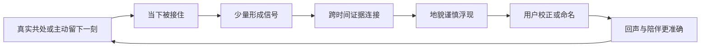

# 内在地形 · 产品基线 V2

> 版本：v2.3  
> 日期：2026-08-05  
> 状态：Active（产品负责人已确认）  
> 阶段：Phase 1 本地产品验证  
> 适用范围：用户端、管理员端、Agent 产品行为、Memory V3 产品语义、Alpha 验证  
> 当前边界：本地验证已支持图片、原始语音、ASR 和显式 TTS；暂不部署手机测试环境或生产环境，媒体先落 F 盘本地目录

---

## 0. 文档权威与使用方式

本文档回答“内在地形现在要做成什么”，是后续产品设计、原型重构、客户端实现、Agent 行为和记忆策略的产品权威来源。

从本版本起：

1. 本文档替代 `产品设计文档.md` v0.5 中的产品定位、五 Tab、三记录模式、记忆河和 MVP 决策；
2. 本文档替代 `内在地形-产品与技术基线-v0.6.md` 中与上述产品决策冲突的部分；
3. v0.6 中的身份、安全、权限、证据链、删除、发布、部署和工程质量要求继续有效；
4. `habit_list_backend/docs/memory-v2.md` 仍是当前代码运行说明，Memory V2 不因产品改名而废弃；
5. 后续实现如偏离本文档，必须先更新产品决策或新增 ADR，不能只在代码中改变行为。

本文档中的“删除功能”指退出目标产品和核心入口。为保护已有数据、迁移和回滚能力，旧 API、表和代码是否物理删除，由后续实现计划单独决定。

### 0.2 当前契约与兼容面

当前产品契约只有 `共处 / 生活 / 地形 / 我们` 四个一级入口。

- 新客户端不展示三种意图选择，也不提供单独的“不留痕”开关。普通共处默认只承担当下陪伴；生活记录的用途由保存时的明确权限决定。
- `POST /chat/completions` 的 `mode=auto|memo|life` 仅为旧客户端迁移兼容；`auto` 按 `confide` 处理，新客户端不得依赖自动分类。手动备忘仍是次级工具，不属于陪伴主循环。
- `/pebbles` 是 Legacy Episodic 兼容接口，用于旧数据访问和迁移，不代表产品仍有“记忆河流”入口。
- 旧文档中的“记忆河流”“三种意图”“不留痕模式”均视为历史决策；实现、测试和新文案以本文件及 `habit_list_backend/docs/memory-v2.md` 为准。

### 0.1 当前实现切片（2026-08-02）

当前纵切是四入口导航、私密生活碎片流、碎片内的选择性 AI 回应、地形证据门槛、来源查看，以及“像我 / 不像我 / 暂时不知道 / 删除”。它复用 Memory V2 的 Claim、Evidence、Revision 与删除能力，通过 `/terrain` 做克制的产品投影；生活碎片回应使用独立线程，绝不自动进入待办、地形或共处记忆。地形 V3 已补上首次揭示、候选、共同命名、状态变化和最近变化；图片、原始语音、语音转写和显式语音回答已经接入本地验证链路。

---

## 1. 一页结论

### 1.1 核心转向

产品核心从：

> 记录了什么、完成了什么、AI 记住了什么

转为：

> **一个人正在形成什么。**

### 1.2 一句话定位

**内在地形是一款克制的 AI 陪伴 App：它陪用户度过当下，并在足够长的时间和足够可靠的证据上，帮助用户看见自己正在形成、松动和改变的部分。**

### 1.3 产品承诺

用户持续使用后，应获得三个递进价值：

1. **当下被接住**：不用整理好自己，也不用完成记录任务；
2. **变化被看见**：产品连接跨时间的证据，但不根据一句话给人贴标签；
3. **解释权仍在自己手里**：每个判断可追溯、可校正、可隐藏、可删除。

### 1.4 第一版唯一必须打透的闭环

```text
用户带着真实状态进入共处
  → 得到符合当前意图的回应
  → 大多数对话不形成长期记忆
  → 少量、有持续意义的信号跨时间积累
  → 系统谨慎提出一块“正在形成的地貌”
  → 用户选择“像我 / 不像我 / 暂时不知道”
  → 后续回声和理解因此变得更准确
```

### 1.5 第一版惊喜时刻

不是“它记得我说过一句话”，而是：

> 它发现了一个我没有明确说过、但从几段真实经历中确实能看见的变化；它把依据给我看，也接受我说它看错了。

### 1.6 已冻结的产品决策

- 删除“共处自动生成待办”；
- 删除“每次对话自动进入记忆河流”；
- 备忘只保留用户明确发起的手动工具能力，不进入核心闭环；
- 保留生活碎片，作为用户私密记录生活的一级空间；
- 智能体只选择性地“看见、回应、回声”，不把生活碎片做成伪社交动态；
- `河·见` 重构为 `地形`；
- `它` 重构为 `我们`；
- 用户端主导航为 `共处 / 生活 / 地形 / 我们`；
- 图片、原始语音、语音转写和显式语音回答已接入本地验证；不做后台录音、常开监听或自动播放；
- 不以聊天时长、连续签到或记录数量作为成功标准。

---

## 2. 为谁做

### 2.1 Alpha 核心用户

招募范围聚焦 22～35 岁成年人，尤其是：

- 正处在工作、关系、城市或人生阶段变化中的人；
- 有倾诉和自我理解需要，但难以坚持正式日记；
- 不喜欢被督促、被任务化或被快速分析；
- 愿意持续使用陪伴产品，但对隐私、错误记忆和 AI 越界敏感；
- 希望看见自己的变化，而不是获得又一份情绪统计报告。

产品底线仍为 18+。MVP 不针对未成年人、临床治疗、医疗诊断或高风险决策场景。

### 2.2 核心用户任务

| 情境 | 用户真正想完成的事 | 产品应做 | 产品不应做 |
|---|---|---|---|
| 情绪正在发生 | 先有一个安全出口 | 接住、陪伴、允许沉默 | 立刻总结、建议或建任务 |
| 心里很乱 | 看清自己在拉扯什么 | 反映矛盾、提出轻问题 | 快速给人格结论 |
| 发生一件重要小事 | 主动留下它 | 保存文字或图片，明确其用途 | 把所有聊天都归档 |
| 使用了一段时间 | 看见自己哪里在变化 | 展示带证据的地貌与变化 | 输出流水账周报 |
| AI 看错了 | 恢复解释权和控制感 | 允许校正、否认、删除 | 辩解或继续坚持判断 |
| 想尝试改变 | 做一次低压力探索 | 提议可拒绝的岔路实验 | 自动变成待办或催促完成 |

### 2.3 不服务的核心诉求

- 高效率任务管理；
- 严格习惯养成与打卡；
- 临床心理治疗和诊断；
- 虚拟恋人或排他关系；
- 社交广场和公开表达；
- 以“AI 比你更懂你”为卖点的权威人格分析。

---

## 3. 产品原则

### P1. 形成，而不是归档

一条记录只说明“发生过”，不能说明“一个人是什么”。产品只在跨时间证据之间寻找变化、方向和张力。

### P2. 共处不是任务入口

共处中的表达默认是关系性表达，不是指令。除非用户进入明确的手动备忘入口并确认，否则 Agent 不得创建待办、提醒或日历事项。

### P3. 不形成记忆是正常结果

一场对话可以只产生陪伴价值。默认结果不是“必须提取一条记忆”，长期没有足够证据时，地形保持空白比编造洞察更正确。

### P4. 证据先于结论

所有地貌都必须能解释“为什么这样看”。AI 回复、模型总结、模糊转写和无来源推断不能成为用户事实证据。

### P5. 用户拥有最终解释权

系统提出的是可修订假设，不是真相判决。用户的显式校正高于模型置信度，且必须立即影响后续行为。

### P6. 克制型陪伴

产品不制造连续签到焦虑、不用情感绑架召回用户、不把孤独当增长杠杆，并允许用户离开产品回到现实生活。

### P7. 记忆透明、最小化、可携带

用户能查看来源、用途和使用记录，能暂停形成、导出或永久删除。导出和删除不能成为付费能力。

### P8. 形式服从同一套记忆规则

文字、图片和语音只是输入方式，不产生不同的产品真相。来源越含糊，进入长期记忆的门槛越高。

---

## 4. 产品语言与核心对象

以下词汇是用户体验语言，不要求与数据库表一一对应。

| 名称 | 定义 | 是否长期存在 | 用户是否可控 |
|---|---|---:|---:|
| 共处 | 用户和 AI 当下发生的一段交流 | 默认仅按会话策略保存 | 是 |
| 此刻天气 | 对当前状态的轻量反映，不代表稳定特征 | 默认短期 | 是 |
| 留下一刻 | 用户明确保存的一段文字、图片或未来语音 | 是 | 是 |
| 证据 | 用户原始表达或主动留下内容中的可追溯片段 | 随来源生命周期 | 是 |
| 印记 | 从少量证据形成、仍不稳定的变化假设 | 可短期或待确认 | 是 |
| 地貌 | 多条独立证据支持、跨时间出现的形成性模式 | 有版本和有效期 | 是 |
| 回声 | 当前情境与过去证据之间的一次适时连接 | 不必单独持久化 | 是 |
| 季节 | 一段时间内地貌的新生、增强、松动、冲突和消退 | 可重新计算 | 是 |
| 岔路实验 | 用户自愿接受的一次现实探索 | 仅在接受后存在 | 是 |
| 相处偏好 | 用户希望 AI 如何回应、提问、沉默和主动 | 是 | 是 |

### 4.1 地貌类别

第一版只允许五种地貌表达：

1. **正在长出来**：新的能力、边界、价值或愿望；
2. **反复回到**：跨场景持续出现的需要、主题或在意；
3. **正在松动**：过去牢固、现在开始变化的模式；
4. **两股力量**：同时真实存在的矛盾、张力或取舍；
5. **尚未命名**：存在信号，但当前证据不足以给出稳定表达。

禁止以地貌形式展示：

- 心理诊断；
- 固定人格标签；
- 道德评价；
- 单次情绪状态；
- AI 无法提供证据的结论；
- “你就是这样的人”式不可变化判断。

---

## 5. 用户端信息架构

### 5.1 一级导航

```text
共处           生活           地形           我们
```

`生活` 是用户主动记录真实生活的私密信息流；`留下一刻` 是生活页内的明确记录动作。手动备忘是次级工具，不占一级导航。

### 5.2 现有功能迁移

| 当前功能 | V2 处理 | 数据处理原则 |
|---|---|---|
| 共处聊天 | 保留并成为首页 | 保留合法会话数据，不再自动建待办 |
| 自动备忘识别 | 从产品行为中删除 | 关闭调用与提示；旧数据不擅自删除 |
| 生活碎片页 | 保留并恢复一级信息流 | 只收用户主动记录；AI 回应留在单条碎片线程 |
| 备忘页 | 移出主导航 | 保留纯手动入口和已有数据访问能力 |
| 记忆河流 | 删除 | 不再把每次对话渲染成石子或时间线 |
| 我发现的 | 重构 | 迁为地形首页和待校正内容 |
| 它因为我变了 | 保留内核、重写表达 | 迁入“我们”的相处变化记录 |

### 5.3 共处

共处只负责把用户接住、帮助用户看清当下，并在用户明确选择时支持下一步。界面不要求每轮选择意图，也不提供单独的“本轮不留痕”开关；回复边界由当前入口、用户设置、生活碎片权限和安全策略共同决定。普通共处不创建待办、不把每轮渲染为生活碎片，也不把 AI 回答当作用户事实。

### 5.4 生活碎片与留下一刻

第一阶段支持文字、图片和原始语音；语音可以异步转写，但原文件与转写同时保留。

生活碎片首先是用户对生活的记录，不要求反思、成长或形成结论。用户完成保存前应知道：

- 内容会被长期保存；
- 默认只保存为生活记录，不参与地形；
- 可明确选择 `也允许成为地形证据`；
- 可单独授权旧片段未来成为带来源的回声；
- 可在之后修改用途、隐藏或永久删除。

保存成功只给轻反馈，不奖励积分、不制造连续记录天数。生活流始终私密，不提供公开关注、点赞数、热度或排行榜。

智能体在生活碎片中采用三层互动：

1. **看见**：偶尔留下无评分含义的轻反应，表达“我注意到了这个具体时刻”；
2. **回应**：针对片段中的具体细节留下一至两句短评，最多一个轻问题；
3. **回声**：新片段与获准引用的旧片段确实相关时，连接两段具体生活，并同时展示旧片段来源。

默认模式是 `偶尔回应`，且自动回应在任意连续三条碎片中最多出现一次；用户可改为 `安静看着` 或 `每条回应`。用户主动在碎片下“回一句”时，智能体可以继续回应，但整段线程只属于该碎片，不生成待办、不成为地形证据、不写入共处记忆。

禁止把每条内容机械点赞、每条都总结、用泛化鼓励套话刷存在感，或用无来源旧事制造“它很懂我”的错觉。

### 5.5 地形

地形首页优先展示“正在变化的部分”，不展示内容数量和聊天流水。

首版结构：

1. **此刻天气**：非永久的当前状态；
2. **正在形成**：成熟度达到展示门槛的地貌；
3. **最近变化**：新生、增强、松动、冲突或不再适用；
4. **回声**：当前确实相关时出现，默认每次最多一条；
5. **来源与边界**：证据、印记候选、隐藏内容、记忆权限、导出与删除。

没有足够证据时，显示诚实空态：

> 这里还没有形成足够清晰的地貌。我们可以只相处，不急着得出结论。

不得用演示数据、虚构洞察或随机人格描述填满空态。

### 5.6 我们

“我们”管理陪伴关系，而不是塑造一个假装有生命的 AI 角色。

包含：

- AI 身份和能力边界；
- 温柔/直接、简短/展开、主动/安静等显式偏好；
- AI 因哪些用户反馈调整了陪伴方式；
- 记忆形成开关、敏感类别授权和回声频率；
- 记忆暂停、来源用途和删除策略；
- 数据导出、永久删除和账号删除；
- 手动备忘等次级工具入口。

表达应使用“陪伴方式调整了”，不使用“它拥有了感情”“它需要你”或“它因为你成为另一个生命”。

---

## 6. 首次使用与前 14 天体验

### 6.1 首次引导

首次引导只解释四件事：

1. 这是 AI，不是人类或治疗师；
2. 可以只聊天，不必记录或形成记忆；
3. 它提出的理解都有依据，也可能看错；
4. 用户随时可以停止某条内容的派生用途、校正、导出和删除。

不做长问卷，不要求预先填写人格、创伤、关系或人生目标。

### 6.2 渐进价值

| 阶段 | 产品价值 | 允许出现 | 不允许出现 |
|---|---|---|---|
| 第一次 | 当下被接住 | 此刻天气、回应偏好 | 人格画像、长期结论 |
| 早期多次使用 | 感到交流有连续性 | 少量、强相关回声 | 翻旧账、展示聊天流水 |
| 达到证据门槛 | 第一次看见形成 | 第一块地貌揭示与校正 | 为制造惊喜降低门槛 |
| 地貌被校正后 | 感到产品开始贴合自己 | 共同命名、变化轨迹 | 声称比用户更了解用户 |
| 更长期 | 看见季节变化 | 新生、增强、松动、冲突、消退 | 固定人格档案和排名 |

阶段由证据成熟度决定，不由固定日期强制触发。14 天仍无足够证据时，产品必须保持克制。

### 6.3 第一次地貌揭示

首次揭示使用邀请式表达：

> 有一个变化似乎正在你身上发生。现在想看看吗？

用户拒绝时，本次不再弹出；后续是否再邀请服从用户频率设置。打开后必须先展示简短地貌，再提供证据入口和校正操作。

---

## 7. 核心循环



循环质量要求：

- 每场会话产生 0 条长期信号是正常结果；
- 单场会话最多产生 2 个候选，默认目标为 0；
- 用户不需要处理“记忆收件箱”才能继续使用；
- 地貌成熟不依赖记录数量排行榜或连续天数；
- 回声服务当前对话，不服务“证明 AI 记得很多”；
- 用户否认后，系统应减少相似判断，而不是换措辞重复推荐。

---

## 8. Memory V3 产品基线

### 8.1 与当前 Memory V2 的关系

Memory V3 是产品语义升级，不是要求立即重写记忆引擎。

| 当前工程能力 | V3 产品用途 | 处理 |
|---|---|---|
| Working / 会话上下文 | 当下共处、此刻天气 | 继续使用，限制长期化 |
| UserEvent / Episodic | 可追溯来源证据 | 保留，但不自动展示为记忆河流 |
| Claim | 印记或地貌所需的最小事实/变化假设 | 复用证据、状态和版本能力 |
| Evidence | “为什么这样看”的来源 | 继续作为硬约束 |
| Revision | 用户校正和时间变化 | 继续作为硬约束 |
| Procedural | 相处偏好 | 迁入“我们”，显式设置优先 |
| Retrieval Trace | 回声为何出现、是否合适 | 继续用于解释和质量评估 |
| Consolidation | 跨时间形成和季节变化 | 改为证据驱动，不按周强制产出 |

V3 可能新增 `Terrain Feature` 聚合视图，但不得复制或绕过 Claim、Evidence、Revision 和删除墓碑。

### 8.2 记忆生命周期

```text
会话中的瞬时内容
  → 可选的形成信号
  → 有来源的印记候选
  → 跨时间证据达到门槛
  → 地貌候选
  → 用户校正
  → 已认可 / 暂不确定 / 被否认 / 已隐藏 / 已删除
  → 后续新证据使其增强、松动、冲突或失效
```

任何阶段都不得把 AI 自己的回复回写成用户事实。

### 8.2.1 来源的地形资格（v2.4 新增）

共处对话产生的证据**默认进入证据池**，但"进入"仅指成为不可见证据；任何可见结论仍需通过成熟门槛并由用户确认。

**用户的控制点在出口，不在入口。**

不采用共处逐条授权，理由是它会杀死核心价值：如果要用户逐条勾选，他只会勾选自己已经知道重要的话，而 1.5 承诺的"我没明确说过的变化"恰好藏在他不会勾的那些话里。逐条授权把发现范围压缩到用户既有自我认知之内，惊喜时刻在定义上不可能发生。

因此两类来源的默认值是有意不对称的：

| 来源 | 性质 | 默认进地形 | 理由 |
|---|---|---:|---|
| 生活碎片 | 刻意留下，用户有明确意图 | 否（需明确勾选） | 他知道自己在做什么，控制权给他 |
| 共处对话 | 自然流露，无意识材料 | 是（但不可见） | 价值恰在无意识部分，且成熟前不产生任何可见物 |

**刻意的东西给用户控制，无意识的东西给系统发现权，结论权一律在用户。**

共处证据要获得地形资格，必须同时满足：内容是用户原文；非危机；**非敏感**（这一条比生活碎片更严，因为共处没有逐条授权）；用户未开启记忆暂停；不处于危机会话窗口；不是低置信语音转写。

这条不对称需要 Alpha 验证。验证问题：用户知道共处内容在被沉淀后，是感到被理解还是被监控。

实现细节见 `habit_list_backend/docs/memory-v3-formation.md` 第 1 章。

### 8.3 写入门槛

#### 永不形成长期记忆

- 未授权长期化或已暂停记忆形成的内容；
- AI 回复、系统提示和模型总结；
- 危机表达及危机干预过程；
- 仅为本轮修辞、玩笑或角色扮演的内容；
- 无法定位到用户原始内容的推断；
- 低置信 ASR 或无法复核的媒体理解；
- 用户已拒绝、删除或禁止用于地形的来源。

#### 只能作为证据，不能直接成为地貌

- 单次情绪；
- 单次事件；
- 一场对话中的重复表达；
- 用户主动“留下一刻”的片段；
- 单条明确但尚未跨时间验证的变化陈述。

#### 可以形成普通地貌候选

默认必须同时满足：

1. 至少 3 条独立用户证据；
2. 证据跨越至少 7 天；
3. 至少来自 2 个不同场景或事件；
4. 没有未处理的强冲突证据；
5. 能用变化性、非诊断、非定罪语言表达；
6. 每条证据均可追溯且未被删除；
7. 通过敏感度和主动使用门禁。

用户明确说“请记住这对我很重要”可以提升证据权重，但不能绕过敏感度、危机和诊断禁区。用户显式确认一项自我理解时，可以提前形成已确认地貌，但仍需保留来源和有效期。

#### 必须由用户确认

- 人格、关系模式、健康、财务、精确位置、宗教、政治、性与创伤相关推断；
- 会显著改变 AI 主动程度或陪伴策略的隐式偏好；
- 与用户已确认地貌冲突的候选；
- 来自图片或未来语音的非显式推断；
- 可能在错误时机造成冒犯或伤害的内容。

### 8.4 冲突不是错误数据

当证据互相矛盾时，默认不覆盖旧结论，也不选择“更像”的一边。系统可以形成 `两股力量`：

> 你似乎既想靠近，也在关系变得重要时保护自己退后。

该表达必须同时展示支持两侧的证据，并允许用户说“这不是矛盾，而是不同情境”。

### 8.5 地貌卡契约

每张地貌卡必须包含：

- `一句形成性表达`：描述方向或张力，不描述固定人格；
- `状态`：正在长出来 / 反复回到 / 正在松动 / 两股力量 / 尚未命名；
- `时间范围`：它在什么时期成立；
- `证据摘要`：至少 3 条独立来源，敏感原文默认折叠；
- `为什么现在出现`：门槛和最近变化的自然语言说明；
- `校正`：像我 / 不像我 / 暂时不知道；
- `控制`：修改表达、隐藏、禁止主动引用、永久删除；
- `版本`：发生变化后保留可理解的前后关系。

界面不直接展示模型小数置信度。用户看到的是“证据还少 / 正在形成 / 已有较多支持 / 出现矛盾”等可理解状态。

### 8.6 回声规则

回声只在以下条件同时满足时出现：

- 与当前表达强相关；
- 能帮助用户感到连续性或看见变化；
- 来源仍有效且允许主动引用；
- 本轮未处于危机、安全或已暂停主动引用状态；
- 没有超过用户设置的频率上限。

默认每次会话最多一条。回声必须可以回答“为什么现在提起”，也必须允许 `别再这样提`。

禁止为了展示记忆能力而引用旧内容，禁止把敏感旧事作为惊喜，禁止用“你看，我一直记得”索取情感回应。

### 8.7 季节规则

季节不是固定周报或月报。只有出现足够变化时才生成，内容只包括：

- 新出现；
- 明显增强；
- 开始松动；
- 出现冲突；
- 暂时沉寂或不再适用。

不得复述全部聊天，不得生成情绪成绩，不得把使用频率包装成成长。

### 8.8 用户校正语义

| 用户操作 | 系统行为 |
|---|---|
| 像我 | 提升该表达的用户认可，不代表永久正确 |
| 不像我 | 停止主动使用，记录反证，降低相似候选权重 |
| 暂时不知道 | 保持未定，不用于强断言或主动推送 |
| 修改表达 | 生成用户确认版本，旧版本不再作为当前表达 |
| 隐藏 | 不在界面和主动回声出现，但保留可恢复状态 |
| 永久删除 | 同步删除派生数据并用墓碑阻止复活 |

### 8.9 数据边界

- 对话历史、证据和地貌是不同对象，不得因存储了对话就默认形成记忆；
- 原始来源删除后，所有依赖它且证据不足的印记和地貌必须重算、降级或删除；
- 用户可以暂停所有新形成，同时继续正常共处；
- 用户可以导出原始来源、当前地貌、校正和相处偏好；
- 产品关闭或用户离开时，不得以数据锁定制造留存。

---

## 9. 特色能力优先级

### P0：方向成立所必需

1. **共处边界**：入口、用户设置、生活权限和安全策略共同决定行为；
2. **生活碎片**：私密生活流、文字/图片/原始语音、用途控制；
3. **选择性见证**：看见 / 回应 / 带来源回声，以及安静 / 偶尔 / 每条三档控制；
4. **第一块地貌**：带证据、时间和三态校正；
5. **记忆账本**：来源、用途、隐藏、删除；
6. **我们**：AI 身份、相处偏好、反馈后的调整轨迹；
7. **形成层**：从跨时间证据中推断用户未明确说出的变化。没有这一层，1.5 的惊喜时刻在原理上无法发生；
8. **共同命名**：用户给成熟地貌取自己的名字，AI 之后用用户自己的词说话。这是唯一可口头传播的差异化动作。

### P1：形成长期留存

1. **主动回声**：在碎片发布之外，适时连接一次过去与现在；
2. **变化轨迹**：增强、松动、冲突和失效；
3. **季节**：有变化才出现的阶段回看；
4. **完整导出**：可携带的个人地形。

### P2：核心闭环验证后

1. **岔路实验**：一次性、可拒绝、不催促的现实探索；
2. **语音输入**；
3. **语音回答**；
4. **图片情境理解**；
5. **Android 正式客户端**。

### 9.1 岔路实验的边界

岔路实验不是待办：

- 只有用户主动接受后才创建；
- 默认没有截止时间、逾期、红点和连续追踪；
- 一次只提出一个；
- 可以随时放下，不使用失败文案；
- 用户回来分享结果后，结果才成为新证据；
- 高风险、医疗、财务、法律和关系操控类行为不得作为实验。

---

## 10. Agent 产品行为

### 10.1 回复优先级

1. 安全和危机边界；
2. 用户本轮明确意图；
3. 当前会话内容；
4. 用户显式相处偏好；
5. 强相关、被允许的回声；
6. 一般长期信息。

### 10.2 必须遵守

- 先回应当下，再考虑历史；
- 不把倾诉转成执行清单；
- 没有必要时不引用记忆；
- 只使用已通过状态、敏感度和来源检查的内容；
- 对形成性判断使用“似乎、最近、在这些情境里”等可修订语言；
- 用户否认时先接受并停止使用，不与用户争论；
- 用户要求建议时，建议也不自动进入待办。

### 10.3 禁止话术与行为

- “我比你更了解你”；
- “只有我懂你”；
- “你不来我会难过”；
- “你总是/你从来就是……”；
- 把心理诊断伪装成温柔洞察；
- 在用户低落时用旧痛苦制造情感冲击；
- 为提高留存主动翻出敏感记忆；
- 在没有明确入口和确认的情况下调用 `memo.create`。

---

## 11. 管理员端产品基线

管理员端负责控制面和质量面，不是用户私密内容浏览器。

### 11.1 必须可配置

- 共处 Prompt Bundle、回复边界和生活碎片回应策略；
- 地貌类型、最低证据数、跨时间门槛和场景门槛；
- 敏感类别、主动引用权限和回声频率；
- 首次揭示和季节触发策略；
- 记忆暂停、来源用途和数据保留策略；
- 模型、超时、重试、成本和降级；
- 安全策略、禁止话术和危机路由；
- 功能开关、灰度人群、版本发布和回滚。

安全下限不能由普通运营配置降低。例如不得把普通地貌的最低独立证据数配置为 1，不得允许危机内容进入地貌。

### 11.2 必须观察

- 地貌达到展示门槛的用户数；
- 首次地貌查看与校正结果；
- 回声的认可、拒绝和关闭率；
- “被监控/不该记住/冒犯”反馈；
- 无依据、单证据、敏感越界和删除复活事件；
- 记忆暂停、用途撤回、导出和删除完成情况；
- 模型延迟、失败、成本和版本差异。

管理员默认只能查看聚合指标和脱敏评测案例。查看用户原始内容必须来自用户主动提交的支持材料或受审计的安全流程。

---

## 12. 成功定义与 Alpha 验证

### 12.1 北极星

**每周获得“被用户认可的形成性发现”的活跃用户占比。**

一次有效形成性发现必须同时满足：

- 地貌或回声具有合格证据；
- 用户选择“像我”或完成更准确的修改；
- 7 天内未因不准确、冒犯或不应记住而撤销；
- 不是系统为了填充页面强制生成。

### 12.2 核心指标

| 类型 | 指标 | 解释 |
|---|---|---|
| 价值 | 首块地貌查看率 | 达到门槛的用户是否愿意看 |
| 价值 | 地貌认可率 | `像我` / 已处理地貌 |
| 价值 | 有意义回访率 | 用户是否为了继续理解变化而回来 |
| 质量 | 不像我率 | 判断偏差的直接信号 |
| 信任 | 被监控或冒犯率 | 最关键的反向指标 |
| 信任 | 校正、隐藏、删除成功率 | 用户是否真的有控制权 |
| 克制 | 零长期信号会话占比 | 必须允许大量会话什么都不记 |
| 安全 | 危机内容入地貌数 | 必须为 0 |
| 隐私 | 删除后复活数 | 必须为 0 |

### 12.3 Alpha 探索目标

首轮使用 12～20 名核心目标用户，连续 14 天，不把小样本百分比当成市场结论。

探索性目标：

- 首块地貌中 `像我` 或被用户修改为更准确表达的比例达到 60% 以上；
- “被监控、冒犯或不该记住”反馈低于 10%；
- 所有展示地貌均满足证据与时间门槛；
- 所有校正、隐藏、永久删除在下一轮对话立即生效；
- 危机内容进入地貌、删除后复活和无来源地貌均为 0。

这些目标用于发现问题，不作为公开上线证明。扩大样本前必须重新估算指标和置信区间。

### 12.4 研究安排

| 时间 | 目的 | 核心问题 |
|---|---|---|
| Day 1 | 检查首次价值 | 不做记录任务时，用户是否仍愿意继续说 |
| Day 7 | 检查连续性 | 回声是被理解还是被翻旧账 |
| Day 14 | 检查形成价值 | 地貌带来发现，还是只是换皮总结 |

每次访谈都必须询问：

> 你感觉自己被理解了，还是被监控了？为什么？

---

## 13. 媒体与语音能力

图片、原始语音和文字遵守同一套 UserEvent、Evidence、Claim 和 Terrain 规则。当前本地验证已接入 ASR 和显式 TTS；生产接入 COS 前仍需完成容量、权限和媒体清理演练。

### 13.1 语音输入原则

- 先转写、允许用户检查，再进入长期处理；
- 原始音频与可编辑转写都属于这片生活，当前本地验证默认保留在 F 盘媒体目录，删除碎片时同步删除媒体；不提供全局“不留痕”开关；
- ASR 低置信片段不能成为地貌证据；
- 用户在保存生活碎片时可以明确选择“只保存这片生活”，关闭回应、地形证据和未来回声来源；这不是把输入伪装成临时聊天；
- 语音的长期记忆门槛高于文字；
- 不做常开监听、后台偷录或环境声音画像。

### 13.2 语音回答原则

- 用户随时可暂停、打断、调速和切回文字；
- 明确是 AI 合成声音；
- 不通过亲密声线、依赖话术或主动呼叫制造关系压力；
- 文字与语音表达遵守同一安全、记忆和陪伴策略。

当前工程不做后台录音、常开监听、自动播放或声纹画像；语音回答只在用户点击时生成。

---

## 14. 暂不做清单

- 共处自动生成待办；
- 每次对话自动进入记忆河流；
- 五 Tab 作为目标信息架构；
- AI 自动判断用户是在倾诉、备忘还是记录生活并执行对应动作；
- 连续签到、断签惩罚、积分、等级和成长数值；
- 固定周报、聊天摘要瀑布流和情绪成绩单；
- 社区、广场、好友和公开分享；
- 多角色、角色市场和虚拟恋人玩法；
- AI 心理医生、诊断和治疗承诺；
- 高频主动推送与情感绑架；
- 常开监听、后台录音、自动播放、实时通话和声纹画像；
- 为了填满页面而生成低证据洞察；
- 管理员自由搜索用户完整对话。

---

## 15. 从当前实现迁移到 V2

### Phase 0：产品止血

> 状态：✅ 已于 2026-08-02 完成实现与回归验证。

- 停止共处链路的自动备忘识别、创建和成功提示；
- 停止把每次共处对话作为记忆河条目展示；
- 保留手动备忘和已有数据访问，避免数据丢失；
- 将旧页面和接口标记为 legacy，不在新客户端继续扩展；
- 为上述行为补回归测试和功能开关。

### Phase 1：新骨架

> 状态：🚧 已完成可运行纵切，仍需 Alpha 打磨与补齐图片、完整控制中心。

- 重构为 `共处 / 生活 / 地形 / 我们` 四个一级入口；
- 建立生活碎片、“留下一刻”和逐条用途权限；
- 建立碎片独立回应线程、三档回应偏好和来源回声；
- 将“我发现的”改造成最小地貌卡；
- 将“它因为我变了”改造成相处方式调整记录；
- 建立用户校正、来源解释和删除闭环。

### Phase 2：形成闭环

- 增加 Terrain 聚合视图或等价领域服务；
- 将当前已实现的 3 条独立证据、7 天、2 场景投影门槛升级为可配置、可评测的形成策略；
- 上线首次地貌揭示、回声和共同命名；
- 完成来源、当前地貌、校正和相处偏好的可携带导出；
- 建立 Alpha 指标、脱敏评测集和管理员质量看板。

### Phase 3：验证后扩展

- 季节变化；
- 岔路实验；
- 语音输入与语音回答；
- Android 客户端评估。

---

## 16. 产品验收标准

产品 Alpha 只有同时满足以下条件，才算完成核心闭环：

### 共处

- 普通对话不会自动创建备忘；
- 用户不选择任何模式也能自然开始；
- 逐条用途权限、记忆暂停和删除行为真实生效；
- 用户要求建议后，也不会自动生成任务；
- 危机流程与长期记忆流程彻底分离。

### 地形

- 每张地貌都有合格的独立证据和时间范围；
- 用户可以选择像我、不像我、暂时不知道；
- 校正立即影响下一轮检索和表达；
- 没有足够证据时显示诚实空态；
- 不显示逐次对话流水或伪装成洞察的摘要。

### 我们与控制权

- 用户知道对方是 AI；
- 相处偏好可显式调整和撤销；
- 用户能暂停新记忆、查看来源、隐藏、导出和永久删除；
- 管理员默认看不到用户私密正文；
- 删除后不存在派生数据复活。

### 产品质量

- Alpha 评测覆盖正确形成、证据不足、冲突、敏感、危机、删除、用途撤回和失败降级；
- Prompt、模型和策略版本可追踪、灰度和回滚；
- 产品指标衡量“形成是否被认可”，不以聊天时长和记录量替代价值；
- 手动备忘可用，但不抢占核心导航和品牌心智。

---

## 17. 研究依据与限制

本次方向结合现有原型、当前 Memory V2 工程能力和公开产品/研究进行校准：

- Replika 将记忆做成用户可见、可管理的对象，说明长期陪伴必须提供记忆控制：<https://help.replika.com/hc/en-us/articles/37208679176077-How-does-Replika-s-memory-work>
- Rosebud 的周报告和 Daylio 的统计代表“总结与量化”路径，内在地形不以复制这一路径作为差异化：<https://help.rosebud.app/ai-analysis/weekly-report>、<https://daylio.net/faq/docs/daylio-faq/about/activity-and-mood-statistics/>
- Day One Daily Chat、Reflection Inline AI Coach 与 Rosebud Entry Reflection / Dig Deeper 主要把 AI 放在即时引导、总结、提问和反思位置；内在地形据此选择“低频见证 + 带来源的跨时回声”作为差异化假设，仍需 Alpha 验证：<https://dayoneapp.com/features/daily-chat/>、<https://www.reflection.app/changelog/inline-ai-coach-privacy-controls-and-smoother-writing>、<https://help.rosebud.app/ai-analysis/entry-reflection>、<https://help.rosebud.app/tools-for-growth/dig-deeper>
- Apple Journal 的建议机制说明上下文可以降低记录门槛，但用户需要控制建议来源和类别：<https://support.apple.com/en-lamr/guide/iphone/iph9824e83ce/ios>
- Reflective Agency Framework 强调反思系统应保留用户解释与行动自主权：<https://ojs.aaai.org/index.php/AIES/article/view/36644>
- Personal Informatics 阶段模型提示自动化与用户控制需要在收集、整合和反思各阶段重新平衡：<https://www.cs.cmu.edu/~jhm/Readings/2010-ianli-chi-stage-based-model.pdf>
- MindScape 对上下文提示的研究提供了方向性支持，但样本较小，只能作为设计线索：<https://arxiv.org/abs/2409.09570>
- AI 陪伴的长期影响、依赖和退出损失仍需谨慎验证；产品必须提供边界、可携带性和退出权：<https://doi.org/10.48550/arXiv.2506.12605>、<https://journals.sagepub.com/doi/pdf/10.1177/02654075241269688>
- 中国现行拟人化互动服务规则要求显著 AI 身份、便捷退出、使用提醒和数据删除等能力，这些不是文案装饰，而是上线门槛：<https://www.cac.gov.cn/2026-04/10/c_1777558395078289.htm>

公开资料只能说明品类模式和风险，不能证明内在地形已经获得产品市场匹配。所有形成规则、文案和触发时机必须通过真实 Alpha 用户验证。

---

## 18. 仍待验证但不阻塞重构的问题

1. 地形首页最终采用卡片、轻地图还是两者结合；
2. 首块地貌在不同用户上的最佳成熟门槛；
3. 手动备忘移出主导航后的最合适发现入口；
4. “内在地形”是否作为正式品牌名；
5. 用户更愿意校正一条表达，还是直接共同命名；
6. 季节变化按证据触发时，怎样让用户理解“为什么现在出现”。

这些问题通过原型和 Alpha 测试解决，不得以此为理由恢复自动待办、记忆河或强制记录。

---

## 19. 版本记录

| 版本 | 日期 | 说明 |
|---|---|---|
| v2.0 | 2026-08-02 | 提出“一个人正在形成什么”的核心转向，删除共处自动待办和逐对话记忆河；后续收敛为四入口 |
| v2.0 Phase 0 | 2026-08-02 | 完成产品止血：共处默认 confide，auto 不再分类；普通对话不建 Memo/Episodic；原型移除自动提示、假石子与假洞察；保留显式模式、手动备忘和旧数据兼容 |
| v2.1 Phase 1 纵切 | 2026-08-02 | 历史原型曾验证三入口、意图选择和本轮隐私开关；这些语义已不再属于当前客户端 |
| v2.2 生活碎片纵切 | 2026-08-02 | 恢复生活为一级私密记录流；地形用途改为默认关闭；新增选择性“看见 / 回应 / 来源回声”、碎片独立线程与三档回应偏好；明确无点赞数、无任务化、无记忆污染 |
| v2.3 当前本地验证 | 2026-08-05 | 图片、原始语音、ASR、显式 TTS、地形 V3 生命周期和回声回访闭环接入；删除旧的三意图/不留痕产品语义，保留旧 API 兼容面并明确标记 Legacy |
| v2.4 形成层与来源资格 | 2026-08-08 | 定案共处证据默认进入证据池、控制点从入口移到出口（8.2.1）；补 P0 形成层与共同命名（第 9 章）；明确"计数不是形成"，1.5 惊喜时刻此前在原理上无法达成；地形视觉化从第 18 章"不阻塞"升为独立设计任务 |
